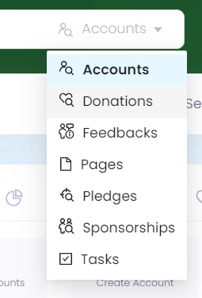
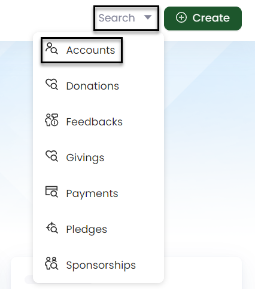
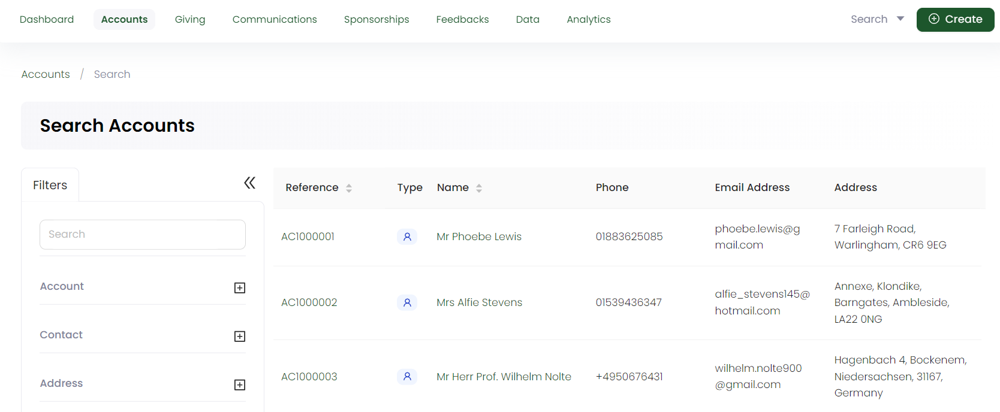
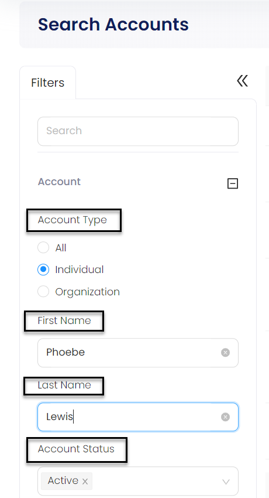
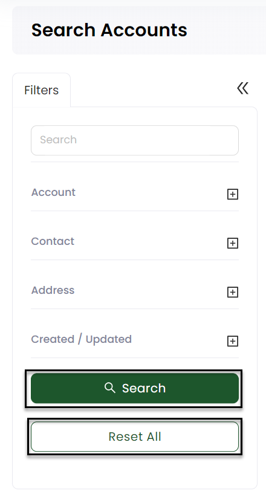

ENGAGE allows you to search for multiple pieces of complete information for accounts, sponsorships, and donations etc via two methods.

- **Global Search** 
- **Advanced Search**

Let's have a look on how to search for a particular account already made by an individual or organization using these methods.

## Using Global Search

1. On the [ENGAGE dashboard](https://beta.n3o.cloud/eu1/engage/dashboard), click the *Quick Search* bar on the top.

2. Select your type of search from the drop-down, in this case *Accounts*.

3. Input the search query. For example, type the reference of any individual account. You can skip the *AC prefix* in the reference number while searching. Select the desired search result and begin using the account.  

:::note
You can also use secondary references like *name, email, phone and address* of an account. 
:::

## Using Advanced Search

The advanced search function is a detailed search option which allows you to search for any data through certain input parameters respective to each type. You can search for accounts that are recently updated or any specific account via a certain parameter among those having similar names.     

1. On the [ENGAGE dashboard](https://beta.n3o.cloud/eu1/engage/dashboard), click the **Search** button next to **Create**. Choose any data you wish to search for, in this case, **Accounts**.

2. The **Search Accounts** screen will display a list of all the accounts saved in ENGAGE and a search **Filters** section.

3. In the **Filters** section, you can modify the search by specifying input parameters accordingly. For example, click the **+** icon next to *Account*. You will see a list of parameters including: 

    1. **Account Type:** Choose the account type.
    2. **Name:** Input the account holders name.
    3. **Account Status:** Select the account status. 

        

    Similarly, you can perform the same actions for **Contact** (email or phone), **Address** (address line, country, postal code, locality) and **Created/Updated** (dates). 

4. Click the **Search** button and the results will appear on the right. Now select the account you were looking for. If you wish to remove the search input for all parameters and start all over again, use the **Reset All** option. 

