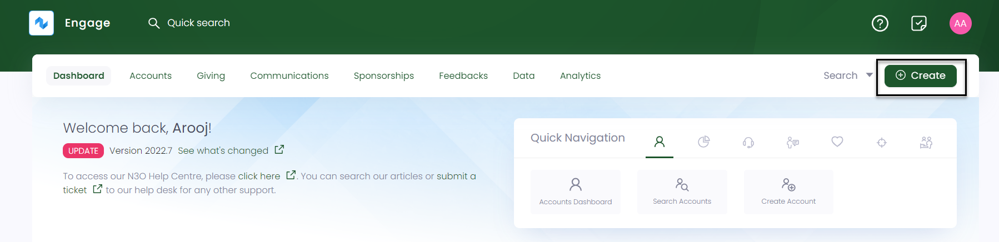
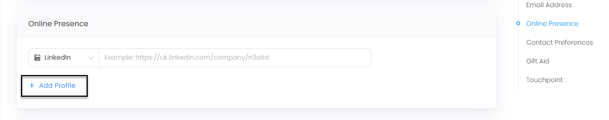
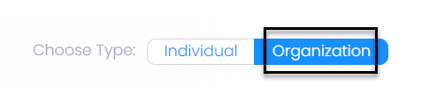
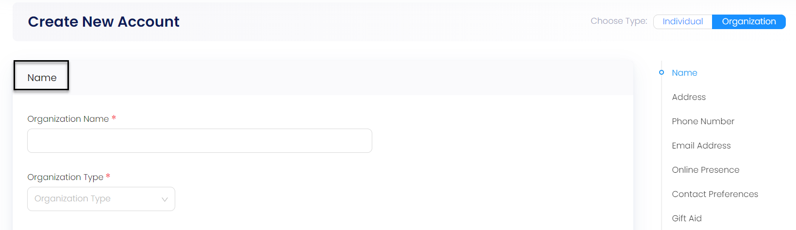
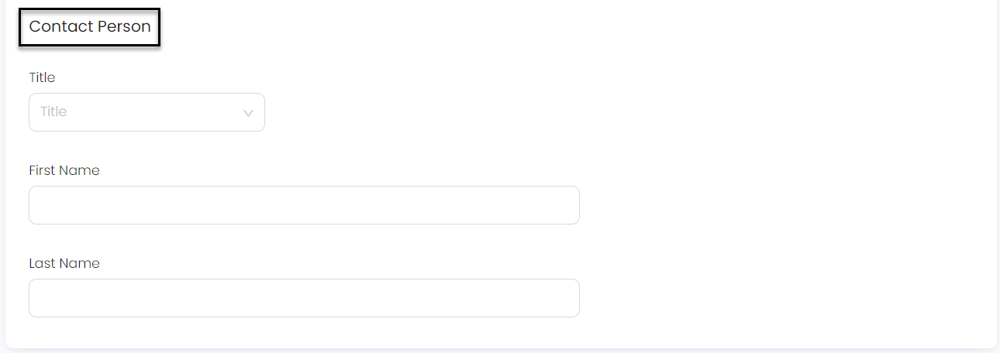

Accounts in **ENGAGE** are separate individuals (donors or supporters) and organizations that donate charity. This article will walk you through creating a new account via ENGAGE.

## Option 1:1 Create an Account from the Dashboard using Create

- On the [ENGAGE dashboard](https://beta.n3o.cloud/eu1/engage/dashboard), click the blue button **Create**. A bar containing different icons will be shown.

- Click the **Create Account** button. This will take you to the create account screen.

## Option 1:2 Create an Account from the Dashboard using Quick Navigation

- On the [ENGAGE dashboard](https://beta.n3o.cloud/eu1/engage/dashboard), navigate to **Quick Navigation**.

- Click on **Create Account** and a screen will appear to create the account.

:::note 
An account can be created for both individual and an organization. Each of them will have different fields to be covered. To follow along, make sure to have the correct information. 
:::

## Create an Individual Account

:::note Important 
- Input boxes with *asterisk* are compulsory to fill in. If you do not, an error message will appear e.g. *"State is a required field"*. 
- By default, create new account screen always opens for an individual account.
- Sometimes, while entering account information, background search might show previously entered accounts with a similar input.   
:::

1. In the *Name* section, specify the **Title**, **First Name** and **Last Name**.

2. Next, in the *Address* section, enter the **Country** you reside in, and it's respective **Postcode**. Input your address as **Line 1**, **Line 2** or **Line 3** and the **Town/City**.

:::info
- Most of the time, the address may appear relative to the postcode search.
- For some countries, address input parameters might be different.
:::

3. Moving forward, in the *Phone Number* section, enter your phone number along with the country code. Then select whether the number is a *fixed line* or *mobile*. You can also add extra phone numbers with **+ Add Phone Number** and remove them with the **Remove** button. 

:::caution
For incorrect and incomplete phone numbers, a **validation pop-up error message** will appear!
:::

4. In the *Email Address* section, input your *Personal* or *Work* email and select it respectively. You can also add extra email addresses with **+ Add Email Address** and remove them with the **Remove** button.

5. After this, in the *Online Presence* section, select the type from the drop-down including *Facebook*, *LinkedIn* and *Instagram* etc and state its example. You can add additional types using **Add Profile** and remove them as wanted with the **Remove** option.

:::note 
Online Presence refers to the combined existence of an individual or organization that is found online via search. 
:::

6. For the *Contact Preferences* section, select the way you want to receive communication i.e. via **Email**, **Post**, **SMS** or **Telephone**. Each category contains five different options named **Unspecified**, **Admin Only**, **Fundraising Only**, **All** and **None**. Select any category. For details, refer to the Contact Preferences(link to page) page.

:::note Important
You can select two categories at one time by using the **Opt-In** and **Opt-Out** options.
:::

7. Next, if you want to add a *Gift*, click **Eligibility** as *Yes*. Then add the **Declaration Date**, **Valid from**, choose **Declaration Source** and attach the source files if needed. For details, refer to Gift Aid Section(link).

8. In the *interactions* section, assign any **Touchpoint** for analytics purposes. Select the **Date** and **Time**. For more information, go to Interactions Section(link).  

9.  Click **+ Create Account**.

## Create an Organizational Account

> **Important**
> **Gift Aid** is not eligible for an organizational account.

To create an individual account, click **organization** on the toggle in the right-hand side.

1. In the *Name* section, input the **Organization Name** and select the **Organization Type** from the drop-down.

2. Choose the **Title**, **First Name** and **Last Name** of the respective *Contact Person*. 

3. Rest of the sections including *Address, Phone Number, Email Address, Online Presence, Contact Preferences and Interactions* are added the same way as for an individual account. You can follow the steps mentioned above.

## You Did It!

Your account is now setup in ENGAGE. Get started and donate as much as you want!

