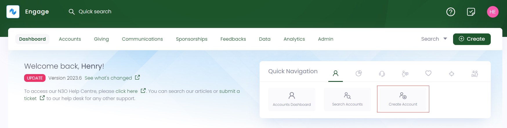
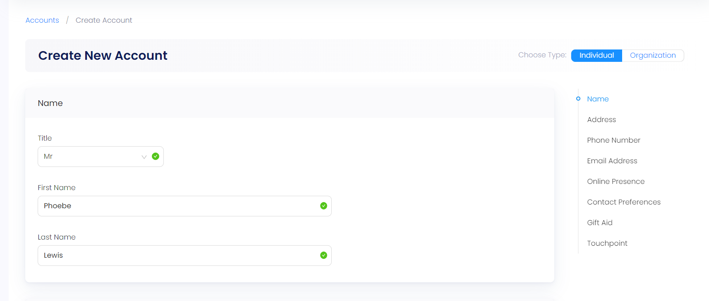
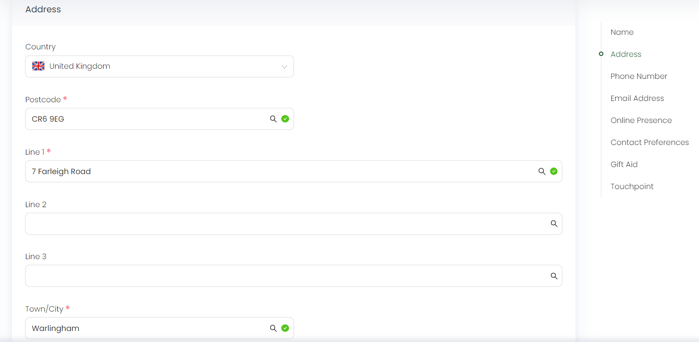
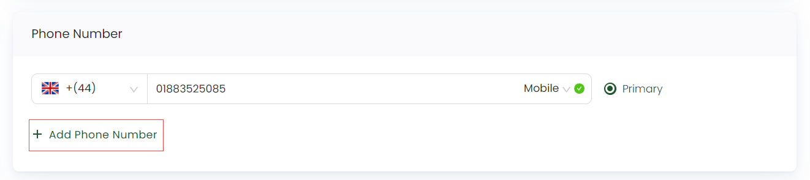
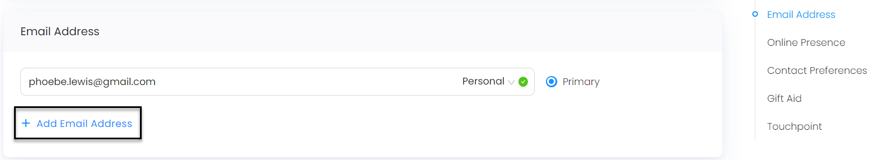
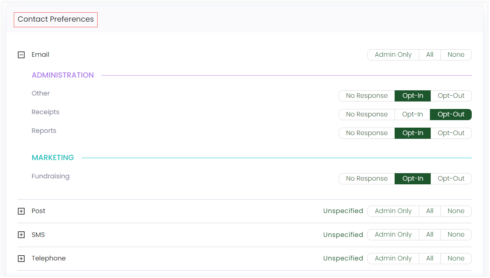
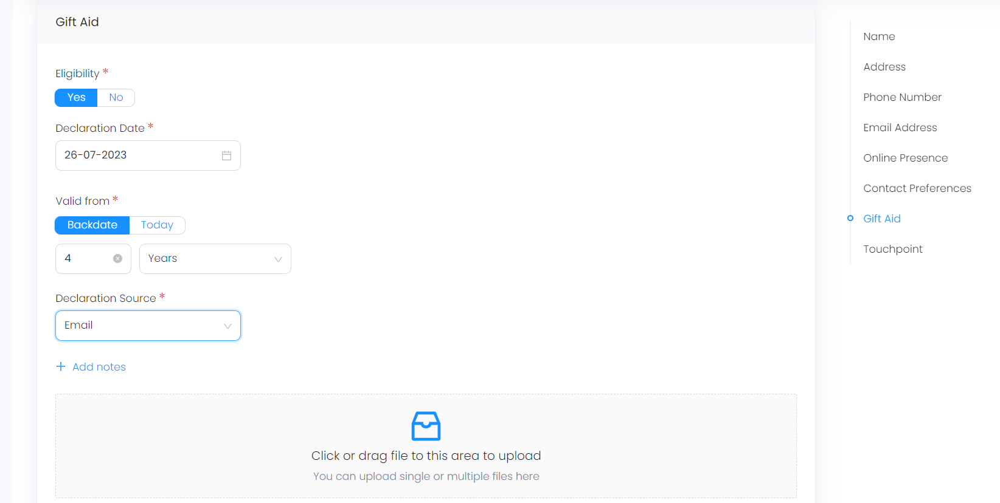
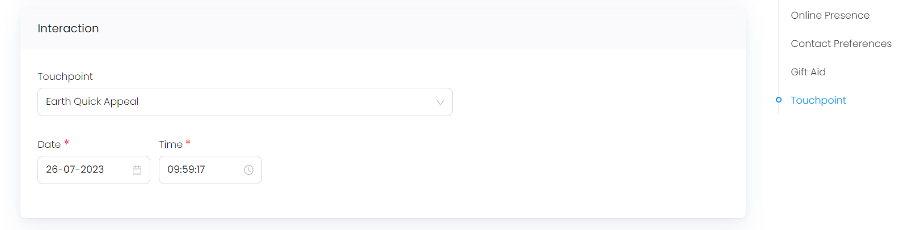

In **Engage**, an account represents an individual or organization (business, school, community group etc.) which interacts with your organization and keeps track of contact details, preferences, donations, sponsorships, etc. in a single place.

Accounts are either individual or organization and are kept separate due to the difference between them regarding tax relief, data protection and many other areas in various locations. Also, Engage advises not to create a household account for a couple or family. In most locations, tax relief and consent options are specific to an individual and will not work as expected if individual accounts are combined. Instead, accounts can be grouped into households after exporting if you wish to do so for purposes such as a postal mailing. 

This article will walk you through creating a new account within Engage.

:::note
To avoid any duplicate account and their problems, first search for an account within Engage.
:::

## Option 1: Create an Account from the Dashboard using Create

- On the <K2Link route="dashboard" text="Engage dashboard" isEngage />, click the **Create** button. A bar containing different icons will be shown.

- Click **Create Account**. This will take you to the create account screen.

## Option 2: Create an Account from the Dashboard using Quick Navigation

- On the <K2Link route="dashboard" text="Engage dashboard" isEngage />, navigate to **quick navigation**.

- Click on **Create Account** and a screen will appear to create the account.

:::note 
Each individual and organization account has its own information that is needed to complete the account details and will vary with each subscription. If that information is not there, you can always come back later and add it. 
:::

## Create an Individual Account

:::note Important  
- By default, create new account screen always opens for an individual account.
- Sometimes, when entering account information while creating an account, e.g. *name, address*, background search may show previously existing accounts with a similar input. A task named as *Possible duplicates found* will appear.

:::

1. In the *Name* section, specify the **Title**, **First Name** and **Last Name**.

:::note
The list of titles is maintained by your system administrator. 
:::

2. Next, in the *Address* section, select the **Country**, and the **Postcode**, if any. Then input the address fields as **Line 1**, **Line 2** or **Line 3** and the **Town/City**.

:::note
- Most of the time, the address may appear relative to the postcode search.
- Some countries might not have a postcode e.g. Dubai, Ireland etc. and their address input parameters might be different.
:::

3. Moving forward, in the *Phone Number* section, enter the accounts phone number in the format "(country code) (phone number)" for e.g. *+447884424343* is a UK phone number with 10 digits saved in the system. Most of the time the system will be able to detect if the number is a *fixed line or mobile*, but if not, set it manually. 

The first number will become the primary number which is the one used by automated processes in the system. You can also add extra phone numbers with **+ Add Phone Number** and remove them with the **Remove** button. 

:::tip
For incorrect and incomplete phone numbers, a **validation pop-up error message** will appear.
:::

4. In the *Email Address* section, input the accounts email. Most of the time the system will be able to detect if the email is *work or personal*, but if not, set it manually. The first email will become the primary email which is the one used by automated processes in the system. You can also add extra email addresses with **+ Add Email Address** and remove them with the **Remove** button.

   

5. For the *Contact Preferences* section, select the way you want to receive communication i.e. via **Email**, **Post**, **SMS** or **Telephone**. For details, refer to the Contact Preferences documentation.

:::note Important
You can select two categories at one time by using the **Opt-In** and **Opt-Out** options.
:::

6. You can also specify **tax relief preferences** associated with the account. For details, refer to Gift Aid documentation.

7. If you wish to track the source of the account for analytics purposes you can do that by assigning an **initial touchpoint** to the account. If unsure, leave this blank. For more information, go to Interactions documentation.  

8.  Click **+ Create Account**. At this point, you may see one or more validation messages in Engage indicating missing or incorrect data that must be specified or corrected to proceed.

## Differences between Individual and Organization Accounts

While creating an individual and organization account, there are some fields which require different information to be added for both. Rest of the sections in an organization account including address, phone number, email etc. are added the same way as for an individual account.

| Field | Individual Account | Organization Account |
| ----- | ------------------ | -------------------- |
| Name | Input **Title**, **First Name** and **Last Name**. | Input **Organization Name** and select the **Organization Type** from the drop-down. |
| Contact Person | Individual account does not have this field. | Input **Title**, **First Name** and **Last Name**. |
| Gift Aid | Specify the tax relief as yes or no. | Tax relief is not eligible for an organization account. |

:::note
The list of organization types is managed by your system administrator.
:::

