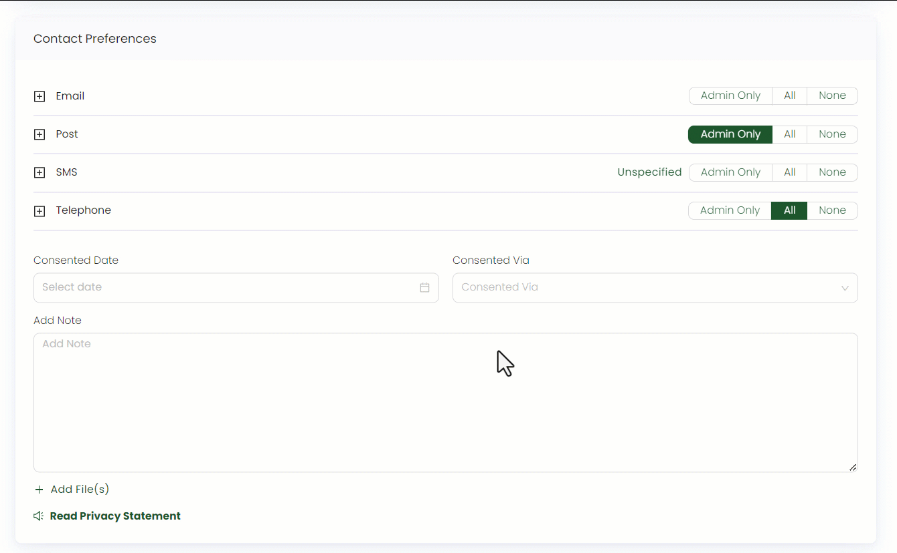
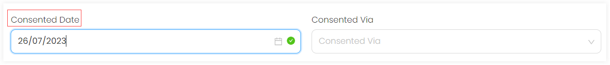
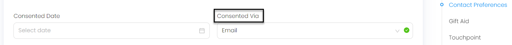
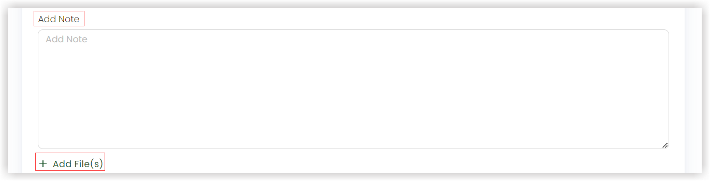
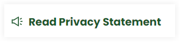

Contact is simply a way that involves meeting or communicating with anyone. So, when a contact wants to receive communication by any means, whether it is by telephone or email we call it a **contact preference**. This is important in terms of knowing and maintaining a valuable relationship with the donor or sponsor (the one you are contacting). 

## Contact Preferences in ENGAGE

ENGAGE allows you to prioritize your contact preferences while creating an account, be it individual or by an organization. There are in total four different types of preferences that ENGAGE provides:

- Telephone
- Email
- SMS
- Post

Each preference contains options that clarify if a contact wants to be contacted for a specific purpose or not.

### Unspecified

This implies that the account owner does not know exactly what they want. For example, the donor might engage themselves in communication methods in the future.

### Admin Only

This shows that the account owner wants to be contacted for administration purposes only like receipts and letters.

### Fundraising Only

This means that the account owner wants to be contacted for fundraising purposes only like direct mail and thank you letters etc. 

### All

This defines that the account owner wants to be contacted for all types including administration and fundraising.  

### None

This means that the account owner does not want any sort of communication.

## How to Add a Contact Preference

You can easily enable any contact preference in ENGAGE by clicking on each respective button. For example, if you want to receive emails for fundraising only, then click **Fundraising Only**. 

But, if you want to be contacted via *Email* for both administrative and fundraising purposes then ENGAGE provides it via another way. Click on the **+** icon next to each preference, and the three options stated below designated for each preference will appear. 

- **No Response**: This implies that you do not want to be contacted for a specific preference.  
- **Opt-In**: This means that along with the original preference you additionally want to enable for another one along with it.
- **Opt-Out**: This defines that either one of the preference will be enabled.

:::note
*Email and Post* contains *Administration* and *Marketing*, but *SMS and Telephone* contains *Marketing* only.
:::

## How to Add Additional Information

### Consented Date

This refers to an official date selected which confirms that you would like to be contacted by a certain contact preference ahead.

### Consented Via

This option marks your consent to be contacted via a certain preference as yes. ENGAGE consent requirements can be configured in the admin section(link) to obey any data protection regulations. You can select any method through *Consented Via*. Click the **down arrow**. This opens up a drop-down list which includes **Email**, **In Person**, and **Letter** etc.

You can add any extra notes related to the topic, if any, in the **Add Note** section and add any consent or approval form, if wanted, via the **+ Add File(s)** option.

Furthermore, ENGAGE provides the account owners leverage to read the privacy statement which includes the organizational practices of handling the users personal information regarding user contact. Click the **Read Privacy Statement** button to do so.     

