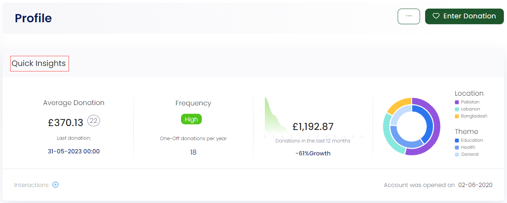
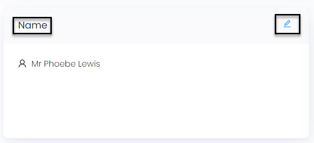
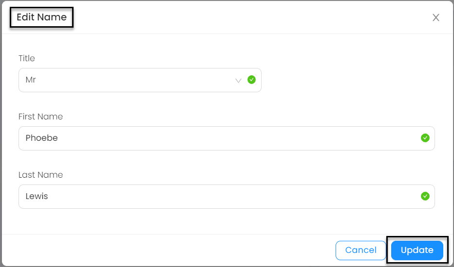
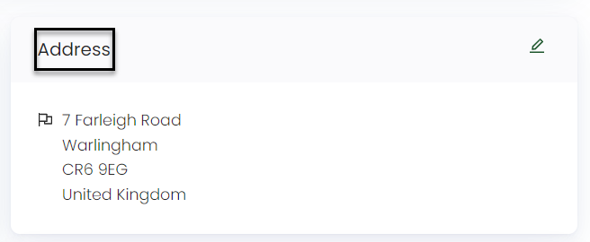
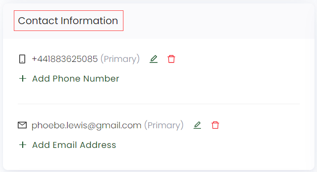
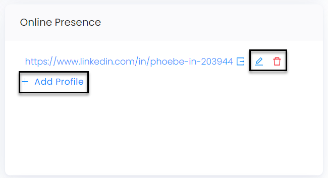
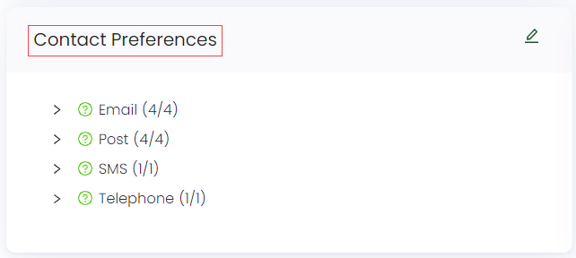

A profile page is a section or webpage that provides information about an individual or entity. It serves as a summary or snapshot of someone's identity, background, or characteristics. Profile pages are commonly found on social media platforms, professional networking websites, and other online platforms including charity funding.

In Engage, whenever a user makes an account, their profile is made on the basis of the information they added. This profile is managed solely by the account user themselves and contains several parts including:

- Quick Insights
- Name
- Address
- Contact Information
- Online Presence
- Contact Preferences
- Gift Aid
- Tasks Bar

Each of these sections can be edited, updated and synced at the same time according to the need.  

## Quick Insights

The **quick insights** section gives information about:

1. The *average donations* total that the account owner has made and the date plus time for the *last* donation made. 
2. The frequency of making donations and the total number of *one-off donations* made per year.
3. The total *amount* of donations made.
4. A pie chart depicting the *location* (where most donations are needed) and *theme* (purpose of donation needed). 

## Name

The **name** section shows the whole name of the account owner, for example, Mr Phoebe Lewis.

You can also edit any part of the name by clicking the **pencil icon** on the right. Simply change and add something new in the *Title*, *First Name*, or *Last Name* and click the **Update** button.  

## Address

The **address** section displays the complete address of the account owner including the country code along with country residing in.

You can also edit any part of the address by clicking the **pencil icon**. Change any part of the information, for example, address *line 1* and click the **Update** button.

## Contact Information

The **contact information** section reveals the phone number, fixed or mobile, and email address of the account owner. You can edit and add the phone number and email address by clicking the **pencil icon** and remove any extra added if needed.  

## Online Presence

The **online presence** section shows the online platform that the account owner is visible through, for example, *Facebook*. You can also edit and add the existing online presence by clicking the **pencil icon**.

## Contact Preferences

The **contact preferences** section presents the preferences selected by the account owner that they want to be contacted through, like *emails*. You can also edit contact preferences by choosing any other options or removing them altogether. Simply click the **pencil icon**, update your preference and click **Update**.

## Gift Aid

:::note
This section appears when making an individual account only
:::

The **gift aid** section shows the eligibility status of the account owner which is selected while making an account. You can edit and update the gift aid information by first clicking the **pencil icon** and then **Update**.

## Tasks Bar

The end of the profile screen depicts a task bar section, that shows a one-liner sentence; **"! There are x tasks associated with this account"**, where x means the number of tasks. To view the list of tasks, click on the **double-upwards arrow**. Each task contains a name and date and can be illustrated in detail via clicking on the task itself. To learn more, go to the Tasks Section(link).

