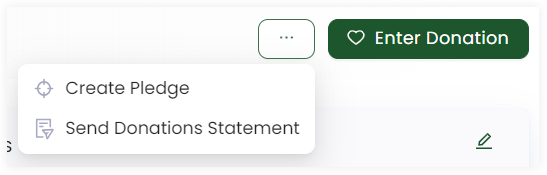
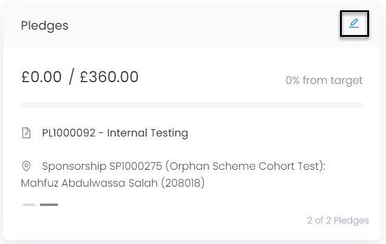
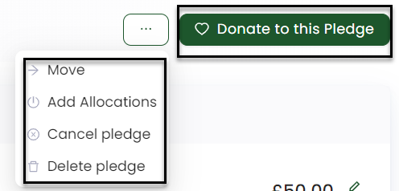
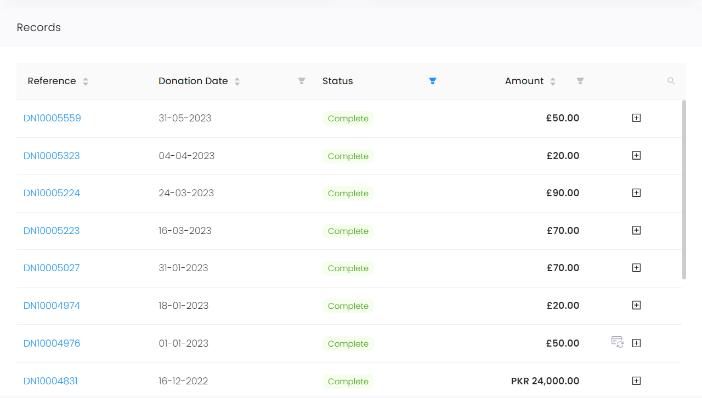
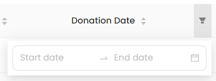
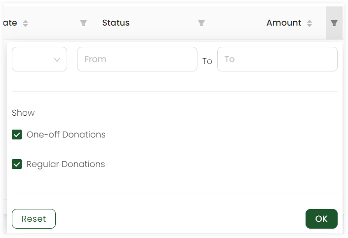

To view all the donations and pledges made by the account, click **Giving** in the profile menu. To read more about donations and givings, go to the Donations Documentation.

## Regular Giving 

This section gives details about all the regular giving donations that the account has made including:

1. Reference number of the donation type
2. Amount allocated for the donation 
3. Type of donation and its status
4. Account name along with the payment method
5. Date of previous and next donation to be made

You can edit this information via the **pen icon** in the top corner. Update any donation type's *credentials*, *commitment* etc. and *Save Changes*. You can also view a *donations record list* for each type. 

Also, you can add more donation with **Enter Donation**, create a new pledge with **Create Pledge** and send a donations statement with **Send Donations Statement** via the **three(...) dots** option.

## Pledges

This section gives information about all the pledges an account created. Each pledge contains:

1. Amount allocated to the pledge
2. Reference number and name of the pledge 
3. Any sponsorship the pledge is associated with

You can view and edit any pledge's information via the **pen icon** in the top corner including *balance allocated* and *ledger list*. Similarly, you can donate more to a certain pledge via **Donate to this Pledge** option on the top and perform other functions via the **three(...) dots** option:

1. **Move** the pledge to a different or anonymous account.
2. **Add Allocations** associated with the pledge.
3. **Cancel the pledge** and choose the reason, add any extra notes and click yes or no for transferring the pledge to another one. 
4. **Delete the pledge**.

## Donation Records List

Under the giving and pledges section, a donation records list is present that contains:

1. **Reference:** The unique identification number of each donation.
2. **Donation Date:** The date a donation was made.
3. **Status:** The status of the donation payment.
4. **Amount:** The amount donated.

To view a donation made in detail, click on its *reference number*. The page opened will show:

- **Donation** details including the name of the *donor, date, status and amount*.
- **Allocation** details which can be edited with the *blue icon*.
- **Payment** details with a list of all payments and total balance. Also, a new payment can be made with the **+ Add Payment** option.  
- **Communication** details with a list of all communication types.
- **Attributions** if added. Also, can update them or set them back to auto. 

You can also view a small summary of allocations description and history of a donation via the **+** button at the end of each row.

### Applying Filters on Parameters

Filters can be applied on following parameters:

1. **Donation Date**
    - Start and End date 

        

2. **Status**
    - Awaiting Allocation: Payment yet to be made for allocations 
    - Awaiting Payment: Payment yet to be made for whole donation
    - Cancelled: Payment cancelled 
    - Complete: Payment complete
    - Draft: Payment to be made in draft
    - Payment Failed: Payment failed to send
    - Pending: Payment has been sent but not yet arrived 

        

3. **Amount**
    - Donation type: Checkmark to show the amount for donation type.
    - Choose amount: Enter the amount to be shown. 

        

