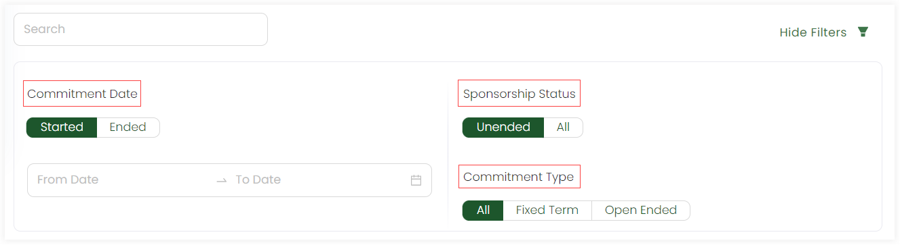
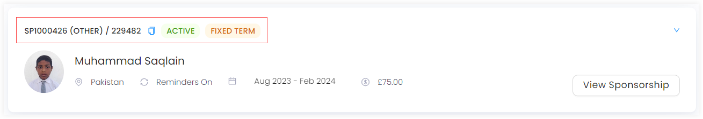
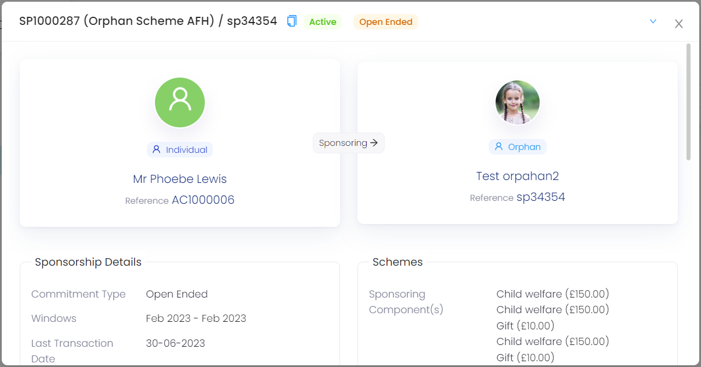
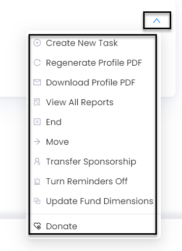

An account can view all the sponsorships sponsored collectively in their account profile via **Sponsorships** from the profile menu.

## Create a New Sponsorship

You can create a new sponsorship via the **Add New Sponsorship** option. For more details, go to the Create Sponsorship Documentation.

## Filters

You can either search for a certain sponsorship or apply any filter to view the exact sponsorship via the **Show Filters** button. The filters include:

- **Commitment Date:** The start and end date for a particular sponsorship.
- **Sponsorship Status:** The status of a particular sponsorship like *Active, Ended or All*.
- **Commitment Type:** The type of particular sponsorship like *All, Fixed Term or Open Ended*.

Each sponsorship viewed contains:

1. Sponsorship reference number
2. The scheme name, location and reference
3. The commitment date, type and status
4. Name and picture of the beneficiary
5. Reminders

## Observing a Sponsorship

To envision a sponsorship in detail, click the **View Sponsorship** button. You will see all the details of the **sponsor**, **beneficiary**, the **sponsorship**, **scheme's** and **ledger**. For example, the scheme used contains information such as *components, date for renewal, location and theme* etc.

Also, each sponsorship contains other *options* which can be used via the **down arrow** in the top right corner of the box. Those options include:

- **Create a New Task:** Creates a new task for a sponsorship.
- **Regenerate Profile PDF:** Regenerates the profile of a beneficiary with the updated details if any as a PDF.
- **Download Profile PDF:** Downloads the whole profile of a beneficiary as a PDF.
- **View All Reports:** Shows all the reports of a beneficiary.
- **End:** Ends the sponsorship.
- **Move:** Moves the beneficiary to a different or anonymous sponsor account.
- **Transfer Sponsorship:** Transfers the sponsorship to a new beneficiary.
- **Turn Reminders off:** Turns off the reminders of all notifications received by the sponsor.
- **Update Fund Dimensions:** Updates fund dimensions for the scheme used.
- **Donate:** Adds more donation for the beneficiary. 

