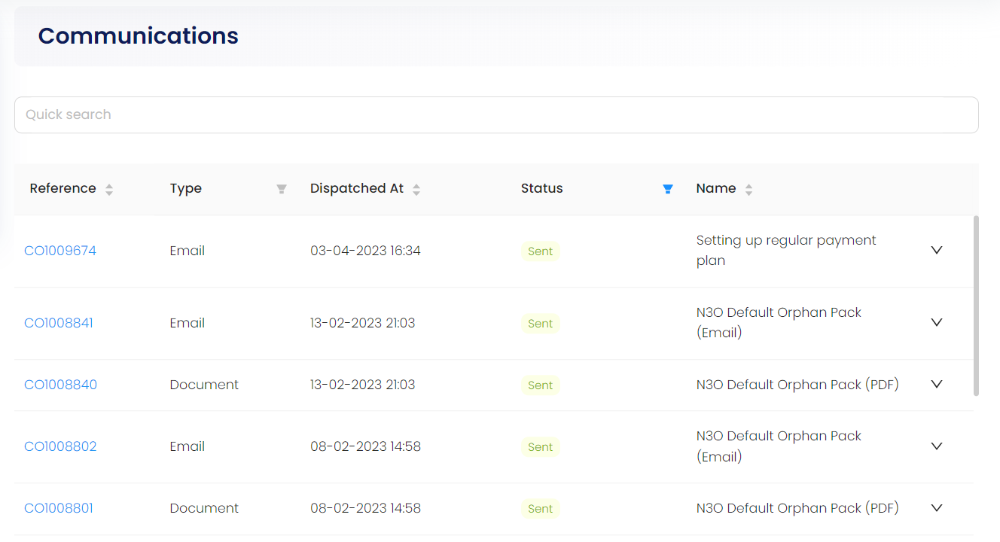
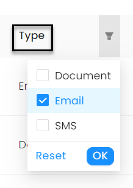
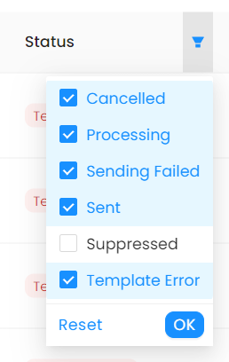
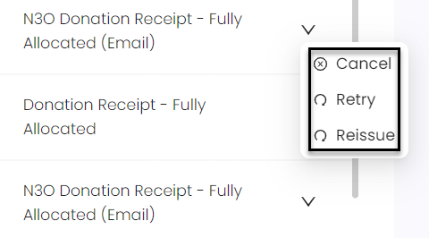
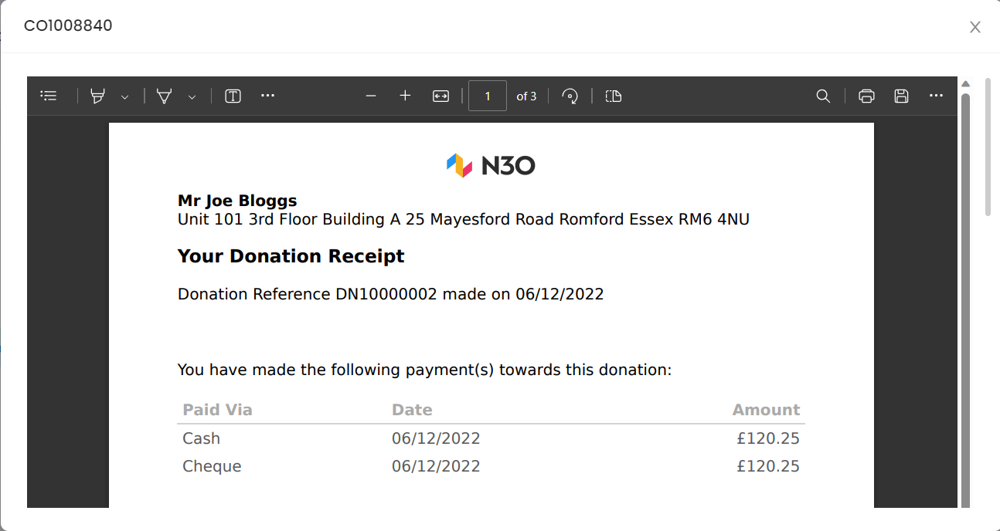

An account owner can view all the communication methods that they used in the form of a list in their respective profile. Select *Communications* from the profile menu and view the results on the right-hand side. Each communication has:

1. **Reference Number:** Individual identification number of each communication used.  
2. **Type:** The type of communication method used.
3. **Dispatched At:** The date and time on which the communication was sent.
4. **Status:** The condition of the communication like has it been sent or still in the queue.
5. **Name:** The subject or title of the communication method being used. 

You can also search a certain communication via the *Quick Search* bar.

## Applying Filters

Certain filters can be applied on some parameters which are **Type** and **Status**. You can also sort rest of the parameters in ascending order like **Reference**, **Dispatched At** and **Name**.

### Type

Tick mark a checkbox if you want to view a *Document*, *Email* or *SMS* and click **OK**. You will see your desired result.

### Status

Select any checkbox in status filters including:

1. **Cancelled:** The communication method has been cancelled.
2. **Processing:** The communication method is still in the process of sending.
3. **Sending Failed:** The communication method has failed to be sent.
4. **Sent:** The communication method has been sent to the account.
5. **Suppressed:** The communication method *opted-out*, is still present at the back end and can be reissued if wanted by the account owner.
6. **Template Error:** The communication method does not have any rendered template to show itself.

Each communication row can be *cancelled, retried to be sent again* and *reissued*. Reissued here means that when a particular communication method has been updated recently, it will be resent with the newest information to the account again. 

Each communication can be viewed in detail via clicking on the respective reference number.

