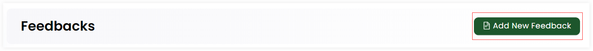
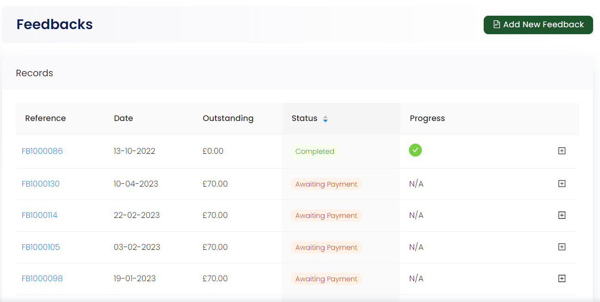
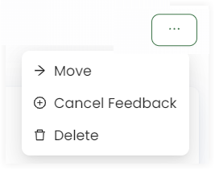
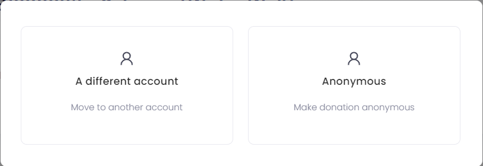

An account owner can view all the records of feedbacks made throughout in the form of a list in their profile via the **Feedbacks** option. 

## Create a New Feedback

You can create a new feedback via the **Add New Feedback** option. For more details, go to the Create Feedback Section(link).

## Explaining Feedback Record List

The record list of all the feedbacks contain:

1. **Reference Number:** Individual identification number of each feedback.  
2. **Date:** The date when feedback was created.
3. **Outstanding:** The price of each feedback yet to be paid.
4. **Status:** The condition of the payment, whether it has been paid or still in awaiting. This can be sorted in ascending order as well.
5. **Progress:** A indication in the form of check or cross of whether payment has completed or not. 

## Viewing each Feedback in Detail

You can view each feedback created by clicking on its *reference number*. This opens up another page to look at every part in detail. Starting with the date and name of person who created the feedback, you can also see the status of payment as *completed* or *awaiting*.

Next, you can engross the details of the feedback including the scheme *name, location and theme* and its specific reports and ledger. 

You can move a certain feedback to a different or anonymous account and cancel it altogether through the three(...) dots in the top corner of the page.

You can view the name and description of each feedback by clicking the **+** option.

Lastly, you can view the whole log meaning history of all the actions made on the feedback, via the **View Log** button. This option opens up a side panel indicating a timeline of all the events/actions that were made by the account owner along with the dates and description.

