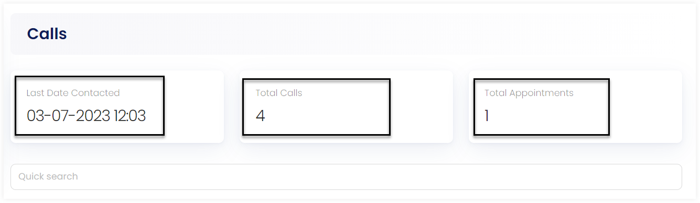
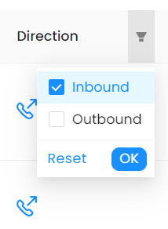
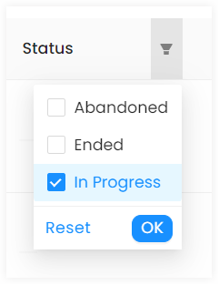

Engage provides a call center functionality to facilitate verbal communications. To get a deep insight, view the Call Center Documentation. Similarly, an account can view records of all the calls made in the account profile via the **Calls** option.

The Calls page includes:

- **Last Date and Time Contacted:** This shows the date and time of the last recent call made.
- **Total Calls:** This shows the total number of calls made to the account. 
- **Total Appointments:** This shows the total number of appointments made. 
- **List of Call Records:** This shows a list of all call records.

## Observing Call List in Detail

The call record list contains:

1. **Reference:** The unique identification number of each call.
2. **Caller:** The name of the caller.
3. **When:** The date and time a certain call was made.
4. **Direction:** The type of call made like *inbound* or *outbound*. 
5. **Status:** The status of a call.

You can view the description of each call via the **+** button at the end of each call row.

### Applying Filters 

You can either search or apply different filters on two parameters of the list, *Direction* and *Status*, to view a specific call.

1. **Direction**
    - Inbound: Incoming calls
    - Outbound: Outgoing calls

    

2. **Status**
    - Abandoned: Calls that are ended before a conversation is started.
    - Ended: Calls that were ended after a conversation. 
    - In Progress: Calls that are still in progress and can be made again.
    
    

