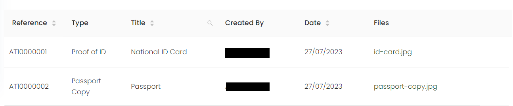
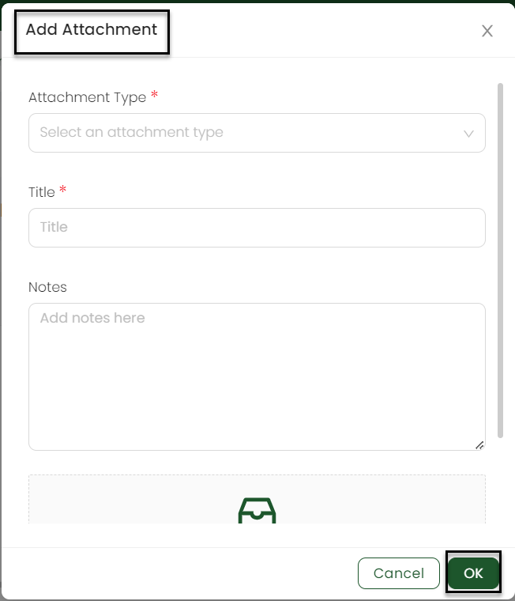

In the context of charity funding, an attachment may refer to a digital file, such as a document, image, video, or any other electronic media, that is added or included along with a donation or funding submission to a charity organization. Individuals or organizations might be required to submit additional supporting documents to complete the funding process. 

Attachments can be relevant in cases like:

- **Smooth Communication:** Uploading attachments electronically streamlines the communication and application process as donors can conveniently submit all required documents in one go.

- **Faster Evaluation:** Having all necessary information and supporting documents available in the form of attachments enables quicker responses on funding applications.

- **Document Security:** Uploading attachments through secure online platforms or email attachments helps protect sensitive information and maintains data security.

## View Attachments in an Account's Profile

:::note
The list of attachment types is managed by your system administrator. Contact them if the attachment type you require is not shown in Engage.
:::

You can view the attachments of each account in the respective account owners profile in **ENGAGE**. The attachments' page shows a list of all the attachments that you have added with each having:

1. **Reference Number:** Number specifying each attachment type.
2. **Type of Attachment:** The kind of each attachment uploaded.
3. **Title of the Attachment:** Name of each attachment uploaded.
4. **Created By:** Name of the account owner who uploaded the attachment.
5. **Date:** Date at which the attachment is uploaded.
6. **File(s):** The file that is attached by account owner.

## Add an Attachment

To add any attachment, simply click the **Add Attachment** button.

Input any **Title**, add any extra notes if needed, upload the attachment file and click **OK**.  

 
