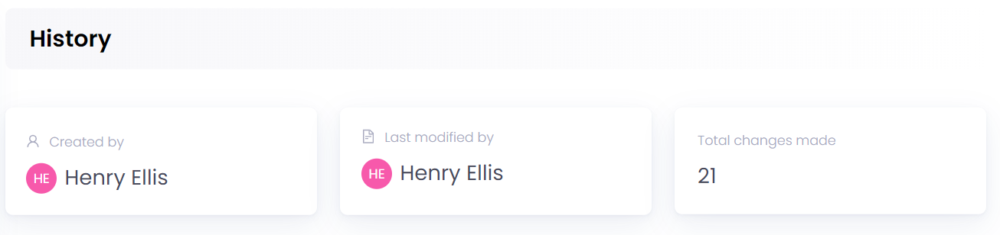
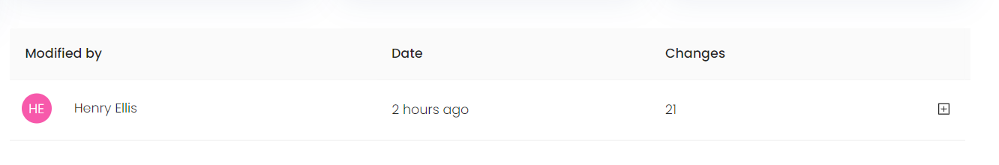
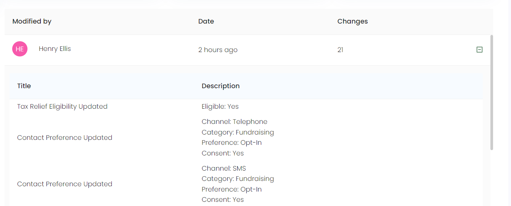

In Engage, you can view all the previous actions that have been taken on a certain account under the history section. Search for any account(link) and click on *History* in the profile menu which shows:

1. Created By
2. Last Modified By
3. Total Changes Made
4. List of All Modifications Made

## Created By

This section shows the **name** of the user. 

## Last Modified By

This information box indicates the **last current change** made by another account on a particular account. For example donor B made a change in donor A's account.

## Total Changes Made

This section depicts the **total number of changes** made by other accounts on a particular account.

## List of All Modifications Made

This section shows a list of all the changes made by different accounts on a certain account including:

1. **Modified By:** The name of the user who made the change.
2. **Date:** The date when the change was made.
3. **Changes:** The total number of changes made.

To view each change in detail, click the **+** icon on the end of each row. When the icon expands, it shows the **Title** and **Description** of each change. For example donor A made a change by adding an *interaction* called *Winter call center campaign on 14-03-2023*.

