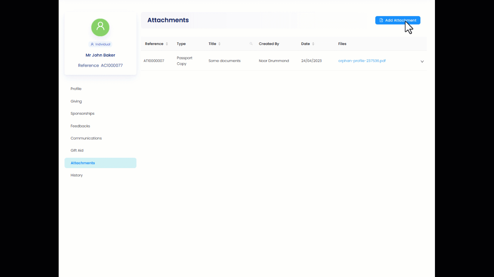

Introduction explaining what attachments are, why you might use them, what not to store in attachments etc.

## Adding an Attachment

To add an attachment to an account in Engage... describe navigation steps

:::note

The list of attachment types is managed by your system administrator. Contact them if the attachment type you require is not shown in Engage.

:::

## Editing an Attachment

## Deleting an Attachment