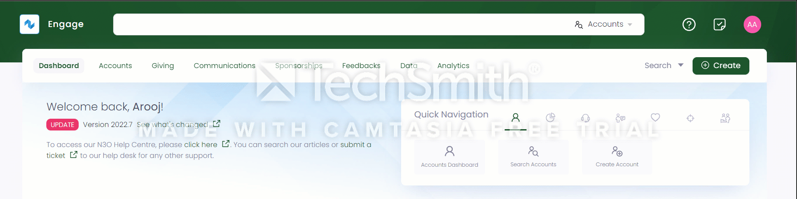
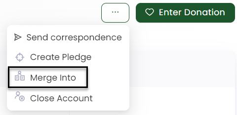
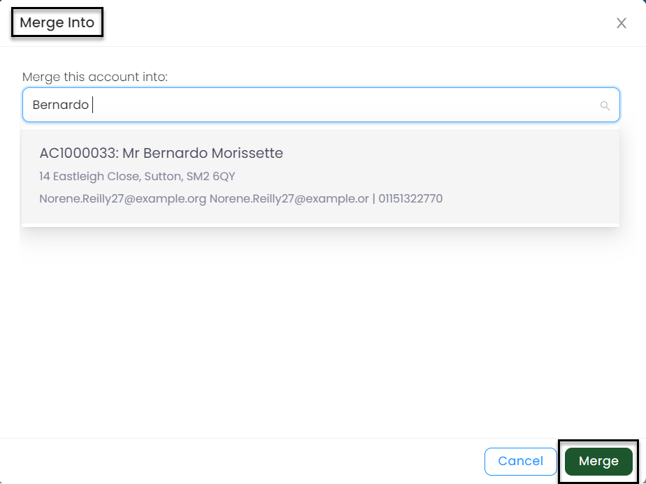

Whenever two records are identical and serve a common purpose, it is likely to merge them together. For example, a donor has donated a certain sum via the website with two different addresses, hence making two different accounts. Therefore, ENGAGE merges such accounts altogether that are found as having duplicate entries. It allows you to preserve the account that is *merged into* and remove the account that is *merged from*.

## Merging Duplicate Accounts

1. From the [ENGAGE dashboard](https://beta.n3o.cloud/eu1/engage/dashboard), use any search method and choose the account you wish to merge from.

2. Within the **Profile** page, click the (...)three dots next to **Enter Donation** on the top right-hand and choose the **Merge Into**. A pop-up screen, **Merge Into**, will be displayed. 

3. Now, search for the name of the account you want to merge into. 

:::note
The account selected from the search in *step 1* will be merged into the account selected in *step 3*.
:::

4. Click **Merge** to merge both accounts.
