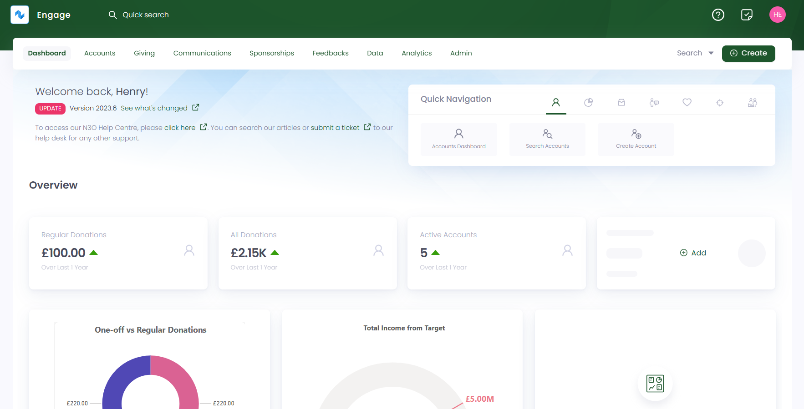
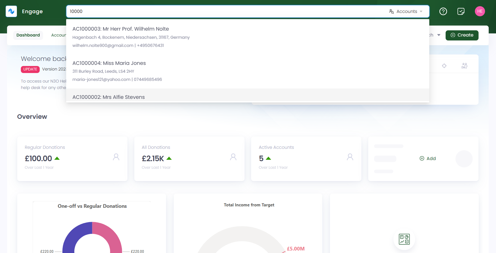
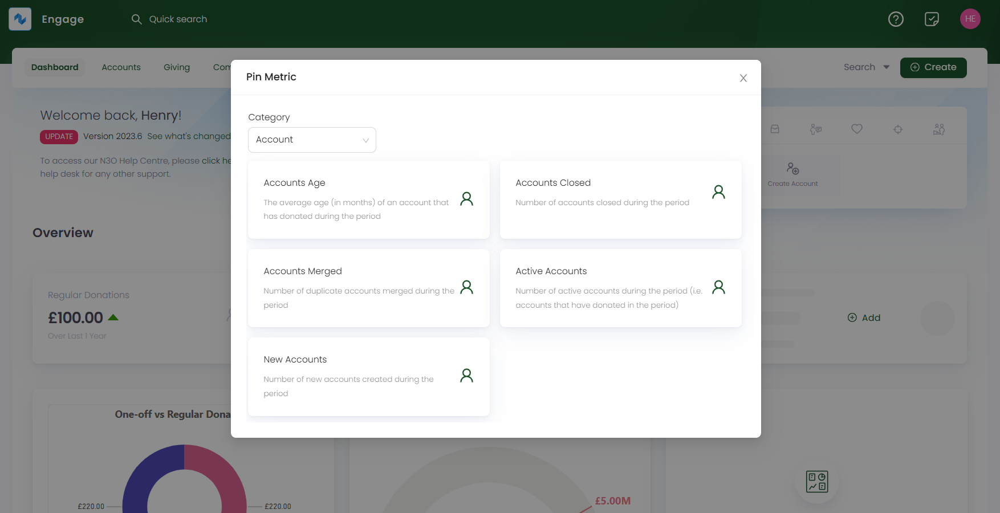
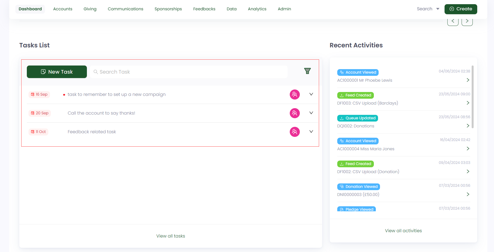
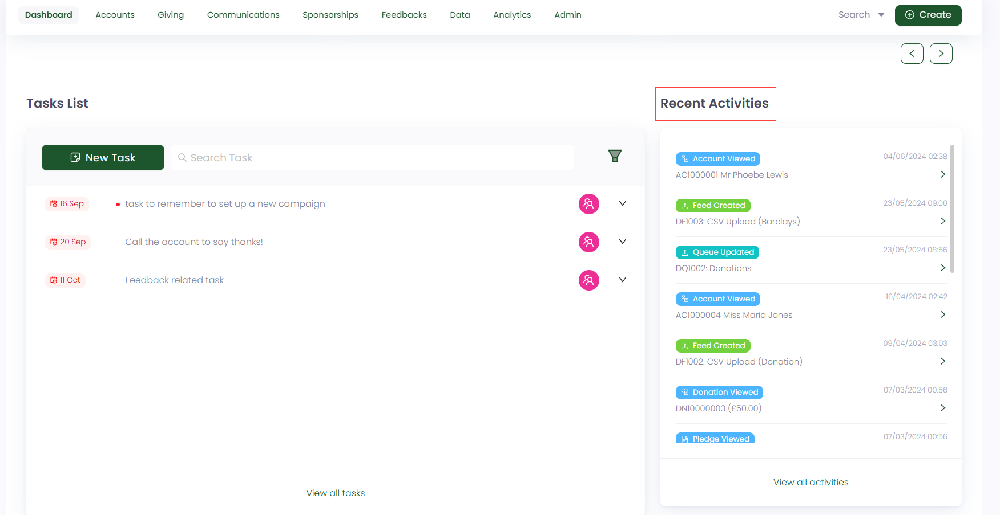
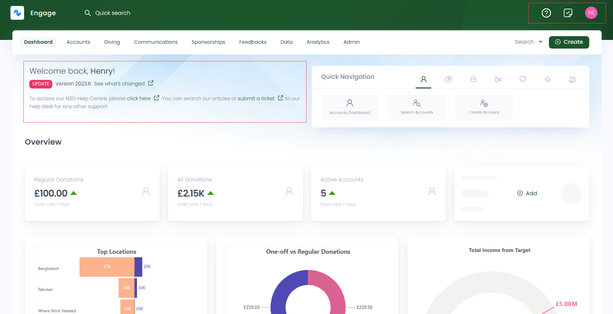

The first part of Engage to look into is the **dashboard**. To land on the dashboard, login to Engage via your email and password. The initial look as soon you open it is like this:

Let us look at the different sections and the actions that can be performed within the Engage dashboard.

## Quick Search

The dashboard includes a **quick search box**, also known as **global search**, available in the header at all times allowing you to quickly search for multiple accounts by reference, name, email and others (sponsorships, donations, feedbacks etc). Set the search scope to either one of them and start searching.

## Quick Navigation

You will also find a **quick navigation box** consisting of links that allow users to easily navigate to different sections under multiple features of Engage. For e.g. you can navigate to the *Create Account* screen by clicking the **Create Account** option under the **accounts icon**.  

## Visual Representations

Multiple visuals depicting certain features that Engage provides, can be added on the dashboard for e.g. regular donations or number of active accounts. You can either add a visual by pinning different metrics right from the dashboard or navigating to the **Analytics** page.

To add a pinned metric visual:

Click **+ Add**, select the **Category** (accounts, donations or regular giving), and choose a metric you want to pin, for e.g. number of accounts that have closed during a certain period of time.

To add a visual from the Analytics page:

Click **+ Add** that will lead you to the Analytics page. Choose **Reports** or either **Analysis** and open up an overview report or analysis for donations, giving or sponsorship. Select any visual, click the **three dots ...** (more options) and choose **Pin to Dashboard**. The selected visual will added on the dashboard. Also, you can add up to 6 different visuals.

## Tasks List

The dashboard also includes a section for all the tasks created within Engage. Each task listed has a **due date**, **task description** and **assignee** defined. You can create a new task via the **New Task** button. To read more about how to create tasks, navigate to the <K2Link route="/docs/engage/accounts/tasks/creating-tasks/" text="Creating Tasks Documentation" isInternal/>. You can also search for a task in the search task bar next to **New Task** button or the quick search bar at the top and speed up your search by filtering the tasks by their status. 

## Recent Activities

The recent activities section show a record of all the actions performed within Engage e.g. account viewed or sponsorship viewed along with the date and time it is performed. You can also view and search for a specific activity via the **View all activities** button.

## Help Section

The help section includes different options that you can try while using Tally.

1. In the top-left corner, you will find a **welcome message**, where you can click on some links to navigate to their respective pages:

- **See what's changed:** This link leads you to the product updates section.
- **Click here:** This link takes you to the N3O support documentation.
- **Submit a ticket:** This link is for contacting N3O for any queries or questions.

2. In the top-right corner, you will find a **question mark symbol**, which will take you to the <K2Link route="docs/" text="N3O Support Documentation" isInternal/>. 

3. Next to the **question mark symbol**, there is a **tasks symbol**. Through this symbol you can:

- Create a new task
- View a list of all assigned tasks
- View a list of all tasks

4. There is also a small **user section** with information about the currently logged-in user, user rights and subscription. Also, you can view findings about:

- Last login date and time
- Timezone
- Language 
- Updating the currently logged-in users preferences
- Logging out

