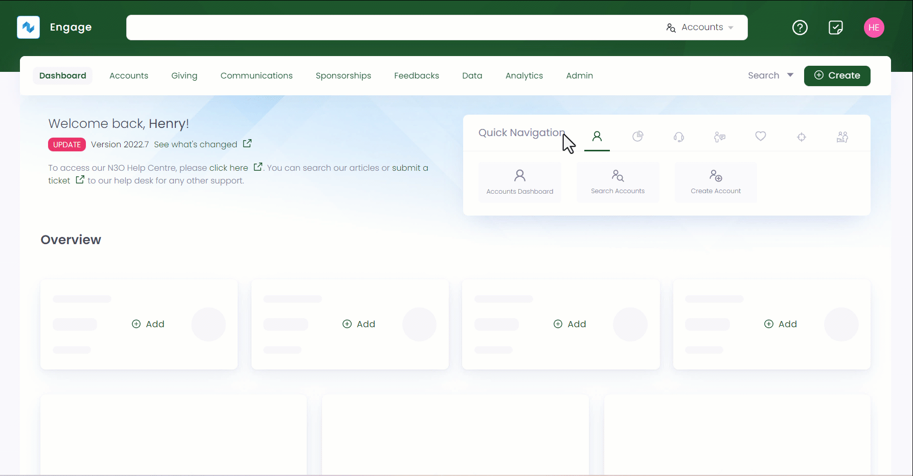
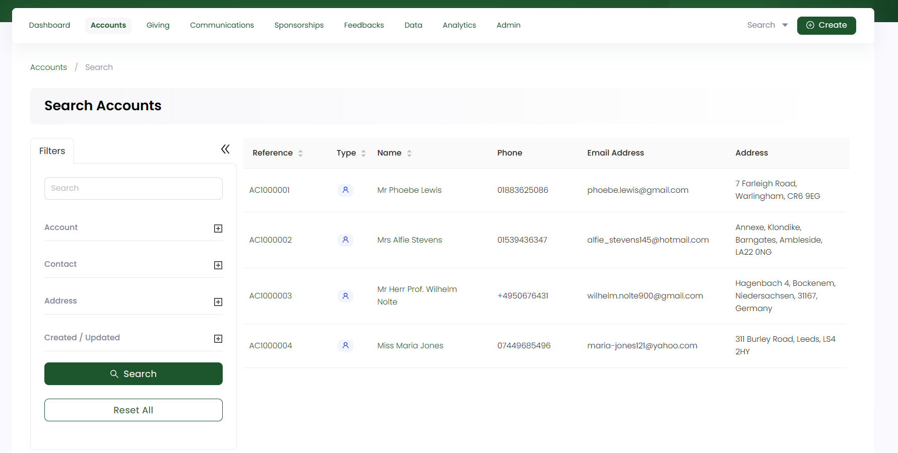

Searching for accounts is one of the most common actions in a CRM. **Engage** makes this quite easier via:

- A **quick search box** available in the header at all times allowing you to quickly search for an account by *reference, name, address, email and telephone number*.

- A dedicated **advanced search screen** for advanced searches, such as recently modified accounts or with more complex criteria.

Let's have a look at how to search for existing accounts irrespective of whether they are individual or organization.

## Using Global Search

**1.** On the <K2Link route="dashboard" text="Engage dashboard" isEngage />, click the **quick search box** in the header. If the search scope is not already set to **Accounts**, change this from the dropdown on the right.

**2.** Input the search query and select the desired search result. For example, type the reference of an account. To search more with different options, look at the table below. 

| Search Type | Search Description |
| ----------- | ------------------ |
| **Reference** | You can either search by the **primary reference** assigned to the account or any **secondary references** (from merging or importing accounts) for e.g. skipping the *AC prefix* in the reference number. |
| **Name** | You can search via the *first name, last name* or the *full name*. Including the *title* while searching is not necessary. | 
| **Telephone** | You can search without the country code for e.g. telephone numbers like *+44777712398* can be searched with *0777712398*.  |
| **Email** | You can search with the full email address of a donor. |

:::note Important
- By default, quick search allows 1 or 2 characters to be different, and they still match (similar matching). This helps with spelling variants like "Muhammad" vs "Mohammad". 
- If no results are found for a certain search input, it could be because the account does not exist, you may have searched by email and the account doesn't have that email, or the person might have moved. Try searching for other information, or ask account for previous address etc. before proceeding to create.
:::

## Using Advanced Search

The advanced search function is a detailed search option which gives you the leverage to search for any specific type of account. You can search for accounts that are last updated or any specific first or last name of an account. Also, you can search for accounts having similar names through other parameters like "date of account creation" or "account email". 

The advanced search screen is made up of a **Filters** panel on the left which you can collapse, and a **results** panel on the right.

**1.** On the <K2Link route="dashboard" text="Engage Dashboard" isEngage />, click the **Search** button next to **Create**. Choose the type of search you wish to perform, in this case, **Accounts**.

**2.** In the **Filters** panel, you can modify the search by specifying input parameters accordingly. For example, click the **+** icon next to *Account*. You will see a list of parameters including: 

1. **Account Type:** Choose the account type.
2. **Name:** Input the account holders name. This appears specific to the account type chosen.
3. **Account Status:** Select the account status. 

**3.** Similarly, you can perform the same actions for **Contact** (email or phone), **Address** (address line, country, postal code, locality) and **Created/Updated** (dates). For the *Created At* option, you can specify only the *From Date* or the *To Date* and do not need to specify both. For example, *From Date: 1 hour ago* with *To Date: nothing* would show accounts created in the last hour only. 

:::note
The dates/times in the **Created/Updated** section are relative to the time the user has set on their account, e.g. account A is set to GMT/London and B to GMT+5/Islamabad. Therefore, when B searches for accounts created since 4AM, that's relative to B's timezone and only those accounts will appear in the result list.
:::

**4.** Click the **Search** button and the results are loaded *"one page"* at a time on the right. To get further results, use a **Load More** button at the bottom of the result list.

:::tip
- If you wish to remove the search input for all parameters and start all over again, use the **Reset All** option. 
- If you need a list of all the accounts in a specific city or name (rather than looking for a specific account) use the <K2Link route="docs/engage/data/lists/" text="lists function" isInternal/>.
- If a duplicate account appears in the search results, it can be because there is duplicate data in their system. To tackle with this, <K2Link route="docs/engage/accounts/merging-accounts/" text="merge the duplicate accounts" isInternal/>, or ask your system administrator to do this for you as it is necessary to have only one account per person or company.
:::