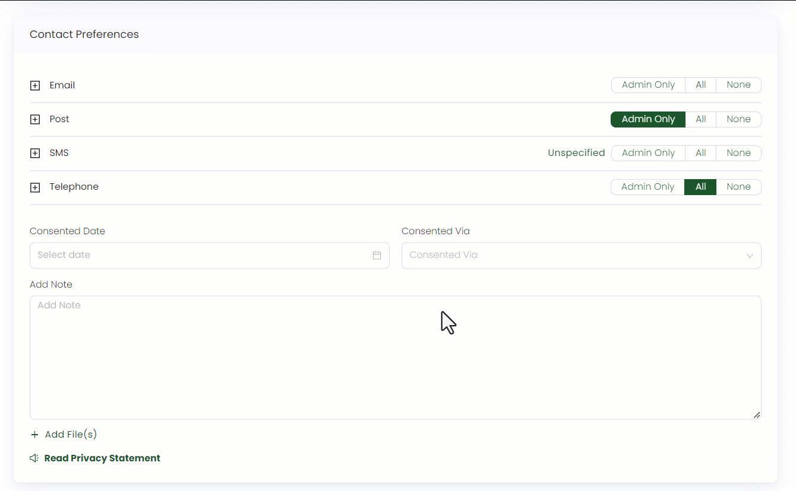

# Enable Contact Preferences

Contact preferences track the different ways of communicating with someone (telephone, post, email, SMS) called *channels*, for different purposes (fundraising, marketing, administration etc.) called *categories*. Both of these can be configured by your system administrator to meet your organization's specific needs.

Maintaining accurate contact preferences is essential not only to ensure a valuable relationship with the supporters, such as opting them out of postal mailers if they have requested, but is also important in many countries for complying with data protection laws.

## Contact Preferences in Engage

Engage allows you to easily manage contact preferences which are shown grouped by channels of communication like:

- Telephone
- Email
- SMS
- Post

Each channel contains one or more categories of communication. Common categories are **Marketing**, **Administration**, **Events** etc. but the exact list can be configured by your system administration.

For each specific way and purpose of communication, Engage is able to record whether the account has opted in to such communication, opted out, or if the preference is unspecified (e.g. unknown).

## Manage Preferences with Presets

Presets provide a quick way of setting up individual preferences and contain different options explained below. Moreover, these presets can be configured, so they might appear different for a subscription.

### Admin Only

This shows that the account owner wants to be contacted for administration purposes only like receipts and letters.

### Fundraising Only

This means that the account owner wants to be contacted for fundraising purposes only like direct mail and thank you letters etc. 

### All

This defines that the account owner wants to be contacted for all types including administration and fundraising.  

### None

This means that the account owner does not want any sort of communication.

## How to Add a Contact Preference

You can enable any contact preference in Engage while creating an account. For example, if you want to receive emails for fundraising only, then click **Fundraising Only**, but, if you want for both administrative and fundraising purposes then Engage provides it via another way. Click on the **+** icon next to each channel, and you will see each preference purpose containing the 3 options explained. 

- **No Response**: This implies that you do not want to be contacted for a specific preference.  
- **Opt-In**: This means that along with the original preference you additionally want to enable for another one along with it.
- **Opt-Out**: This defines that either one of the preference will be enabled.

## Additional Information

### Consented Date

This refers to an official date selected which confirms that you would like to be contacted by a certain contact preference ahead.

### Consented Via

This option marks your consent to be contacted via a certain preference as yes. Engage consent requirements can be configured in the admin section(link) to obey any data protection regulations. You can select any method through *Consented Via*. Click the **down arrow**. This opens up a drop-down list including **Email**, **In Person**, and **Letter** etc.

You can add any extra notes related to the topic, if any, in the **Add Note** section and add any consent or approval form, if wanted, via the **+ Add File(s)** option.

Furthermore, Engage provides the account owners leverage to read the privacy statement which includes the organizational practices of handling the users personal information regarding user contact. Click the **Read Privacy Statement** button.     

