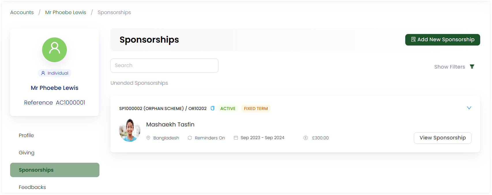
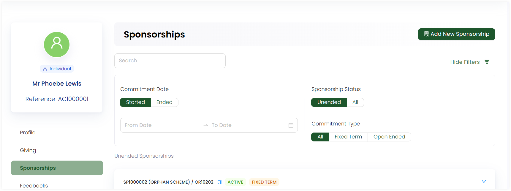

An account can view all the sponsorships sponsored collectively in the account profile via **Sponsorships** from the profile menu. The sponsorship section includes:

1. Create a sponsorship option
2. Sponsorship details for different beneficiaries

## Create a New Sponsorship

You can create a new sponsorship via the **Add New Sponsorship** option. For more details, go to the <K2Link route="docs/engage/sponsorships/creating-sponsorships/" text="Create Sponsorship Documentation" isInternal/>.

## Observing a Sponsorship

All the beneficiaries sponsored by the specific account will appear under the sponsorships section. Each sponsorship viewed contains:

1. Sponsorship **reference number**.
2. The **scheme name**, **location** and **reference**.
3. The **commitment date**, **type** and **status**.
4. **Name** and **picture** of the beneficiary.
5. **Amount** donated towards the sponsorship.

To envision a sponsorship in detail, click the **View Sponsorship** button. You will see all the details of the **sponsor**, **beneficiary**, the **sponsorship**, **scheme's** and **ledger**. For example, the scheme used contains information such as *components, date for renewal, location and theme* etc.

Also, each sponsorship contains other options which can be used via the **down arrow** in the top right corner of the box. Those options include:

- **Donate:** Adds more donation towards the beneficiary. 
- **View All Reports:** Shows all the reports of a beneficiary.
- **Extend:** Extends the sponsorship longer than the specified period.
- **End:** Ends the sponsorship.
- **Replace Beneficiary:** Transfers the sponsorship to a new beneficiary.
- **Update Fund Dimensions:** Updates fund dimensions for the scheme used.
- **Create New Task:** Creates a new task for a sponsorship.
- **Turn Reminders off:** Turns off the reminders of all notifications received by the sponsor.

**Advanced** options include:

- **Change Commitment Type:** Changes the commitment type of the sponsorship.
- **Edit Beneficiary:** Navigates to the Umbraco beneficiary page to edit any information.
- **Move:** Moves the beneficiary to a different or anonymous sponsor account.
- **Regenerate Profile PDF:** Regenerates the profile of a beneficiary with the updated details if any as a PDF.
- **Update Dates:** Updates the begin on and end date for the sponsorship.

### Applying Filters to View a Sponsorship

You can either search for a certain sponsorship or apply any filter to view the exact sponsorship via the **Show Filters** button. The filters include:

- **Commitment Date:** The start and end date for a particular sponsorship.
- **Sponsorship Status:** The status of a particular sponsorship e.g. *Active, Ended*.
- **Commitment Type:** The type of particular sponsorship e.g. *Fixed Term or Open Ended*.

