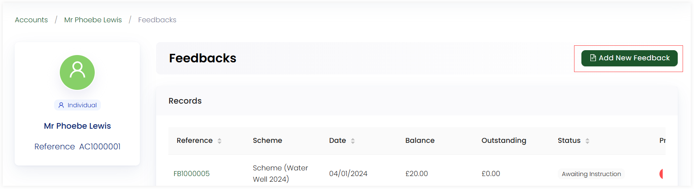

An account can view all the records of feedbacks made in the form of a list via the **Feedbacks** option in the account profile. 

## Create a New Feedback

You can create a new feedback(link) via the **Add New Feedback** option.

## Feedback Record List

The record list of all feedbacks contains multiple parameters. You can view the name and description of each feedback by clicking the **+** option.

1. **Reference Number:** Individual identification number of each feedback.  
2. **Date:** The date when feedback was created.
3. **Outstanding:** The price of each feedback yet to be paid.
4. **Status:** The condition of the payment, whether it has been paid or still in awaiting. This can be sorted in ascending order as well.
5. **Progress:** A indication in the form of check or cross of whether payment has completed or not. 

## Viewing each Feedback in Detail

You can view each feedback created by clicking on its *reference number*. Each feedback in detail includes:

- Date and name of person who created the feedback
- Status of payment as *completed* or *awaiting*. 
- Details section including the feedback scheme name, location and theme etc.
- Specific reports and ledger section. 
- History of all the actions made on the feedback, via *View Log*. This option opens up a side panel indicating a timeline of all the events/actions that were made by the account along with the dates and description.

You can move a certain feedback to a different or anonymous account, cancel if the feedback is in awaiting payment status, or delete through the **three(...) dots** in the top corner of the page.

