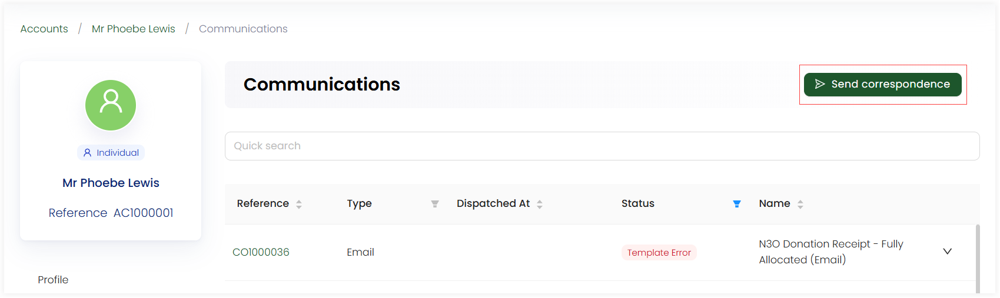
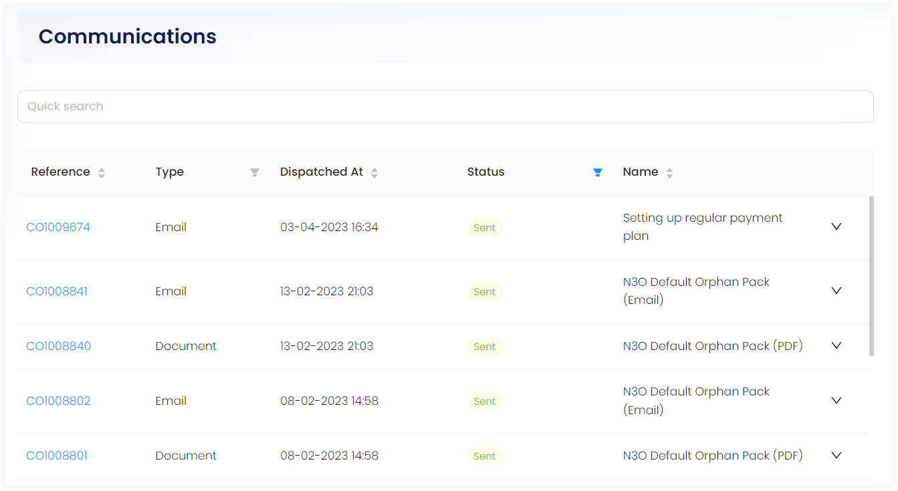
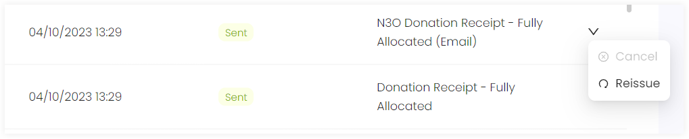
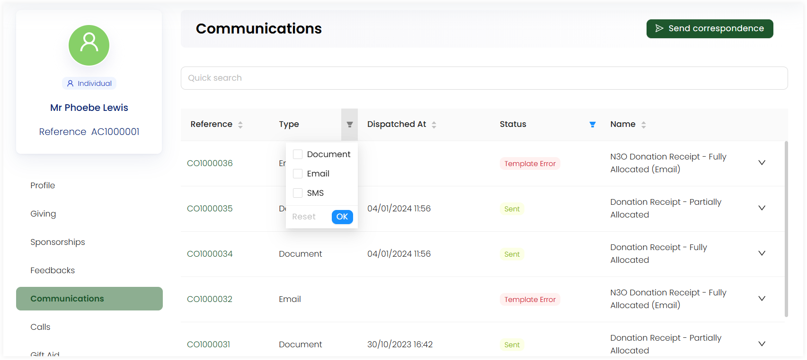
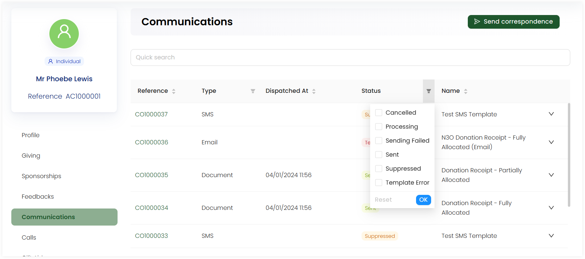

An account can view all the communications sent in the form of a list. Select **Communications** from the profile menu and view the following options:

1. Send a communication option
2. Communication records list

## Send a Communication

You can send a new communication related to the account via the **Send correspondence** option. For more details, go to the <K2Link route="docs/engage/communications/outboxes/sending-templates-via-outbox/" text="Sending Templates via Outboxes Documentation" isInternal/>.

## Communication Records List

Each communication in the list includes:

1. **Reference Number:** Individual identification number of each communication used. You can also click on the reference number to view the communication type. 
2. **Type:** The type of communication method used.
3. **Dispatched At:** The date and time on which the communication was sent.
4. **Status:** The condition of the communication like has it been sent or still in the queue.
5. **Name:** The subject or title of the communication method being used. 

A communication method used can be viewed in detail via clicking on the reference number and can be **cancelled**, **retried to be sent again** and **reissued**. Reissued means that when a particular communication method has been updated recently, it will be resent with the newest information to the account again. 

### Applying Filters

To search and view a specific communication, you can apply filters on parameters of the list including **Type** and **Status**.

#### Type

Tickmark a checkbox if you want to view a **Document**, **Email** or **SMS** and click **OK**. You will see your desired result.

#### Status

Select any checkbox in status filters including:

1. **Cancelled:** The communication method has been cancelled.
2. **Processing:** The communication method is still in the process of sending.
3. **Sending Failed:** The communication method has failed to be sent.
4. **Sent:** The communication method has been sent to the account.
5. **Suppressed:** The communication method *opted-out*, is still present in the database and can be reissued if wanted by the account.
6. **Template Error:** The communication method does not have any rendered template to show itself.

