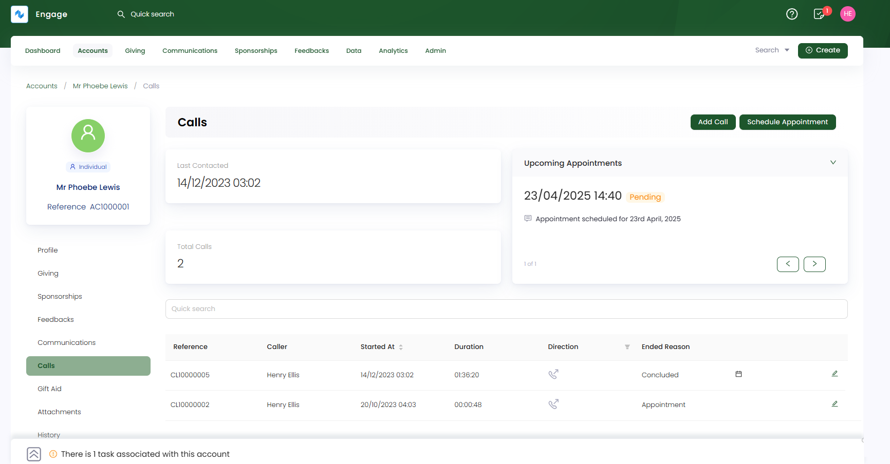

Engage provides a call center functionality to facilitate verbal communications with its donors. To get a deeper insight into this feature, view the <K2Link route="docs/engage/communications/call-center/" text="Call Center Documentation" isInternal/>. Similarly, an account can view records of all the inbound and outbound calls made in their account profile.

Click **Calls** in the profile menu. Starting from the top, the "Calls" page shows:

- **Last Date and Time Contacted:** The date and time of the last recent call made.
- **Total Calls:** The total number of calls made to the account. 
- **Total Appointments:** The total number of appointments made. 
- **List of Call Records:** A list of all call records.

## Add Manual Calls to the Donor Account

Callers can now add manual outbound and inbound calls to the donor account for recording and other purposes. Click **Add Call** and input the following information to save a call.

1. **Call Direction:** Type of call, *inbound* or *outbound*.
2. **Date and Time:** The date and time for the call. As soon as time is selected, it shows the **duration** of the call in "minutes and seconds".
3. **Call Purpose:** The reason why the call will be made *(selected from the dropdown)*.
4. **Call Disposition:** A label describing the outcome of the call *(selected from the dropdown)*.
5. **Call Ended Reason:** The reason why the call ended with the donor *(selected from the dropdown)*.
6. **Event Activity Window:** For how long after a call was made should Engage attribute events (e.g. making a donation, starting a sponsorship) to the call.
7. **Notes:** Any notes to be added with the call.

## Observing Call List in Detail

The call record list contains:

1. **Reference:** The unique identification number of each call.
2. **Caller:** The name of the caller.
3. **Started At:** The date and time a certain call was made.
4. **Duration:** The time duration in hours and seconds for a call.
4. **Direction:** The type of call made like **inbound** or **outbound**. 
5. **Ended Reason:** The end reason for a call.

You can edit a call and view its description via the **pen icon** at the end of each call row.

### Applying Filters 

You can either search or apply different filters on two parameters of the list, **Direction** and **Status**, to view a specific call.

1. **Direction**
    - **Inbound:** Incoming calls
    - **Outbound:** Outgoing calls

    

2. **Status**
    - **Abandoned:** Calls that are ended before a conversation is started.
    - **Ended:** Calls that were ended after a conversation. 
    - **In Progress:** Calls that are still in progress and can be made again.
    
    

