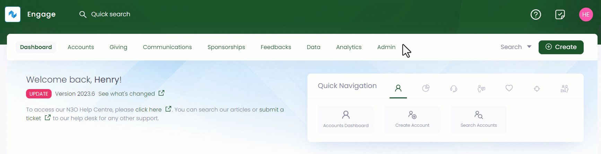
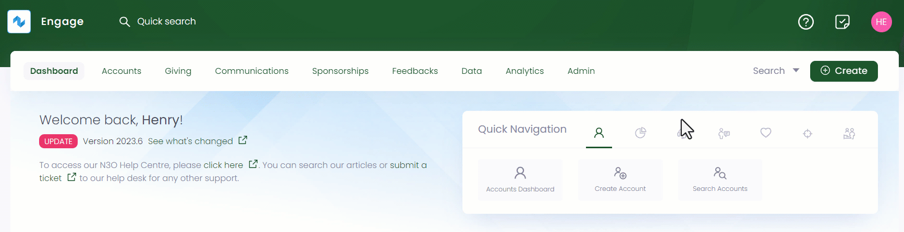
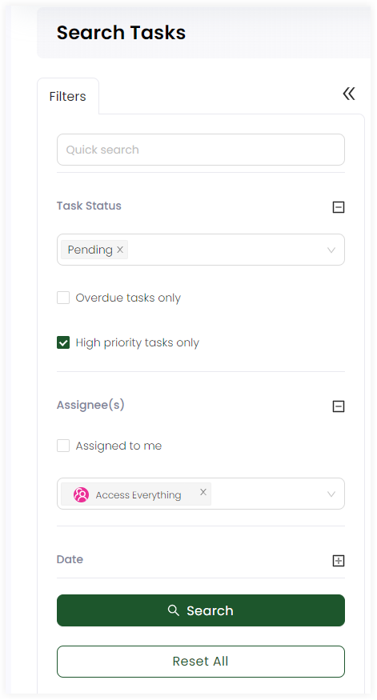

Just like creating and editing a task, an account can search for a particular existing task in Engage via two easy methods.

1. A **quick search box** available in the header at all times allowing you to quickly search for a task by *reference and task description*.
2. A dedicated **advanced search screen** for advanced searches, such as high priority tasks only or assigned to a particular account.

Let's have a look at how to search for an existing task.

## Using Global Search

1. On the <K2Link route="dashboard" text="Engage dashboard" isEngage />, click the **quick search box** in the header. If the search scope is not already set to **Tasks**, change this from the dropdown on the right.

2. Input the search query and select the desired search result. For example, type the reference or description of a task.

:::note Important
- You can either search by the primary reference assigned to a task or any secondary references for e.g. skipping the *DN prefix* in the reference number.
- If no results are found for a certain search input, then it could be because the task does not exist, it might have been deleted or marked as complete.
:::

## Using Advanced Search

The advanced search function is a detailed search option that allows you to search for any existing tasks created on specific dates or for a specific account. The advanced search screen is made up of a *Filters* panel on the left which you can collapse, and a *results* section on the right.

:::note
- **View Assigned Tasks** prepopulates the search task list of your account by automatically tick marking the **Assigned to me** checkbox.
- **View All Tasks** shows a search task list of all tasks irrespective of any condition.
:::

1. On the <K2Link route="dashboard" text="Engage dashboard" isEngage />, click the **View Assigned Tasks** or **View All Tasks** option from the *checklist icon* in the top right corner.

:::note Important
You can search through the advanced search option for a certain account or all the accounts by performing *step 1* either through the *Engage dashboard* or the account owners profile page.
:::

2. In the **Filters** section, you can modify the search by specifying input parameters accordingly. For e.g., you can specify any *keyword* to view a specific task or choose the task status. 

Click the **+** icon next to the: 

- **Task Status** and select *Pending* or *Completed* according to need. Checkmark for **Overdue tasks only** or **High priority tasks** when needed.
- **Assignee(s)** and select any other account or checkmark **Assigned to me**, if searching for your own account tasks.
- **Date** and input the **Due Date** or select the user in **Created By** which created the task. For the *Created/Modified At* option, you can specify only the *From Date* or the *To Date* and do not need to specify both.

:::note
The dates/times in the **Created/Modified** section are relative to the time the user has set on their account.
:::

3. Click the **Search** button and the results are loaded *"one page"* at a time on the right. Use a **Load More** button at the bottom of the result list to get further results.

:::tip
If you wish to remove the search input for all parameters and start all over again, use the **Reset All** option. 
::: 

