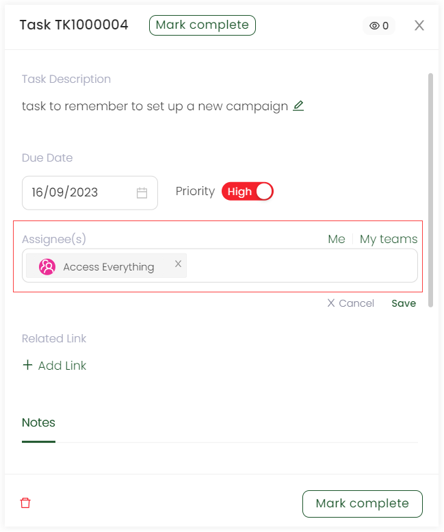
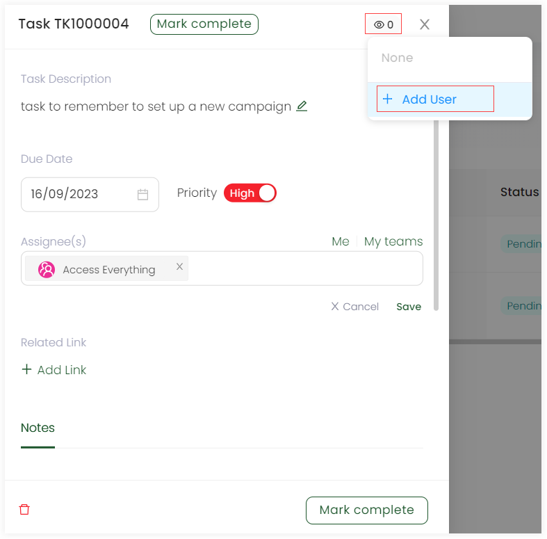

Creating tasks in Engage is a super quick process. Follow the steps defined below in detail.

1. On the <K2Link route="dashboard" text="Engage dashboard" isEngage />, click the **checklist icon** in the top right corner and click **Create New Task** or scroll down to the *Tasks list* and click **New Task**.  

2. On the **New Task** pop-up screen, specify the following input parameters and click **OK**.

:::note
You can also create and assign a task to a specific account. Just <K2Link route="docs/engage/accounts/searching-accounts/" text="search for an account" isInternal /> and perform steps 1 and 2. *Related Link* input parameter will automatically prepopulate the task to that specific account.
:::

| Parameters | Description |
| ---------- | ----------- |
| **Task Description** | A *one liner description* for the new task being made. |
| **Set Due Date** | The *date* by which the task should be completed. |  
| **Priority** | The importance of the task as *High* or *Low*. High priority tasks when created have a red circular dot at the start of the task description. | 
| **Assign to** | The assignment of the task. It can be for the administrator *(Me)*, a specific account/sponsorship or accessible to everyone *(My teams)*. | 
| **Related Link** | The donor account or sponsorship etc. to whom the task will be related to. Specify the type by clicking the down arrow and search accordingly. |
| **Add More Details** | A button to add more details related to the task, if any. Also, any task file made externally can also be added with the *Add File* option within. |

## Communicating with Others on a Task

While creating and editing a new task, different accounts can have a conversation on a particular task to ensure that the task is completed and not set late. To acquire such functionality, you can use the two methods.

1. Navigate to the **Assign to** input field and choose **My teams** or select any specific user whom you wish to converse with.

2. Open up a specific task and click the **eye symbol** on the top corner of the task screen. Select **Add User** option and make the visible to the users you add.

