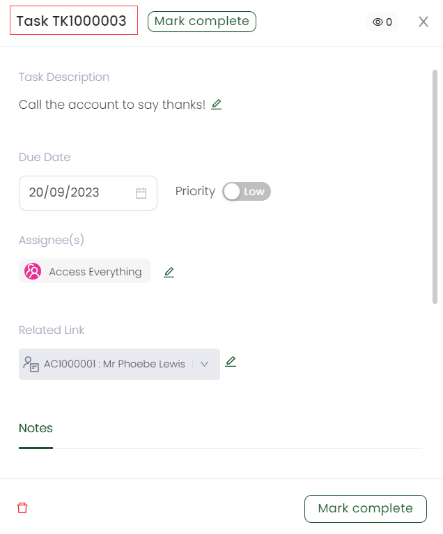

In Engage, tasks can be edited and updated as necessary by the relevant account or any other user. To edit a task, use the following steps defined.

1. Search for the task you wish to edit or scroll down to the *Tasks List* on they <K2Link route="dashboard" text="dashboard" isEngage /> for a list of all the tasks created.

:::note
You can also edit a task directly via the account's profile. Click the **upwards arrow** on the *task bar* at the end of the page. You'll find a list of tasks associated to the account to update.

:::

2. A pop-up screen will appear with title **Task + Task Reference Number**.

3. Edit any input parameter like the **Task Description**, **Due Date**, or **Assignee(s)** for the particular task and click **Save**.

4. The task will be updated with a pop-up message, **Success: Task is updated!**.

:::note Important
- In the *Tasks List* section on the Engage dashboard, you can search for tasks via their description, set filters e.g. high priority or overdue and click the task to view it in detail.  
- If any task is completed with all necessary requirements, click the option **Mark as Complete**. 
:::

