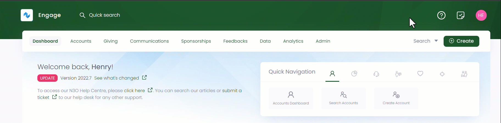
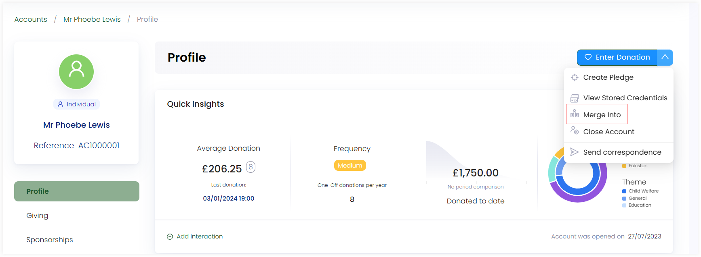
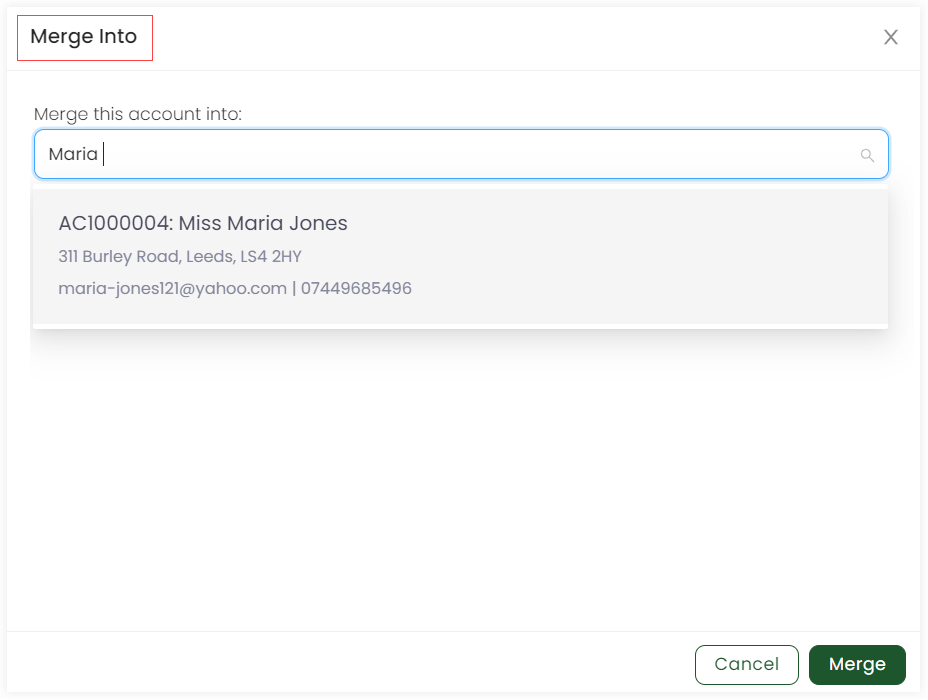

Whenever two records are identical and serve a common purpose, it is likely to merge them together. For example, a donor has donated a certain sum via the website with two different addresses, hence making two different accounts. Therefore, Engage merges such accounts altogether that are found as having duplicate entries. This allows to preserve the account that is **merged into** and remove the account that is **merged from**.

## Merging Duplicate Accounts

**1.** In the <K2Link route="dashboard" text="Engage dashboard" isEngage />, use any search method and choose the account you wish to merge from.

**2.** On the **Profile** page, hover over the **down arrow** next to **Enter Donation** on the top right-hand and choose **Merge Into** to display the **Merge Into** pop-up screen. 

**3.** Now, search for the name of the account you want to merge into and click **Merge** to merge both accounts.

:::note
The account selected from the search in *step 1* will be merged into the account selected in *step 3*.
:::

