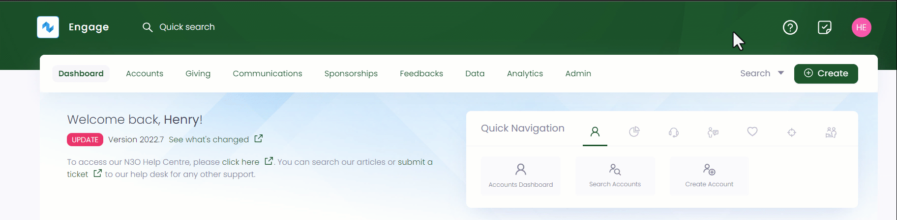
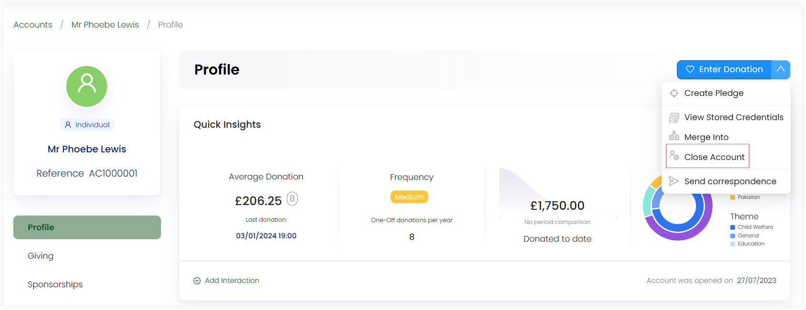

Deleting an account in Engage is quite quick and simple. But you can always come back to create an account again. 

**1.** In the <K2Link route="dashboard" text="Engage dashboard" isEngage />, click the **quick search box** in the header or use the **advanced search option** and search for the account you wish to delete.

**2.** On the profile page, hover over the **down arrow** next to **Enter Donation** and choose **Close Account**. A pop-up screen, **Close Account**, will be displayed. 

**3.** Now, select the **Reason** for the account closure and decide whether you want to remove any personal identifiable information from the account by clicking **Yes** or **No**. Add any additional notes in the **Notes** section and click **Close Account**.

