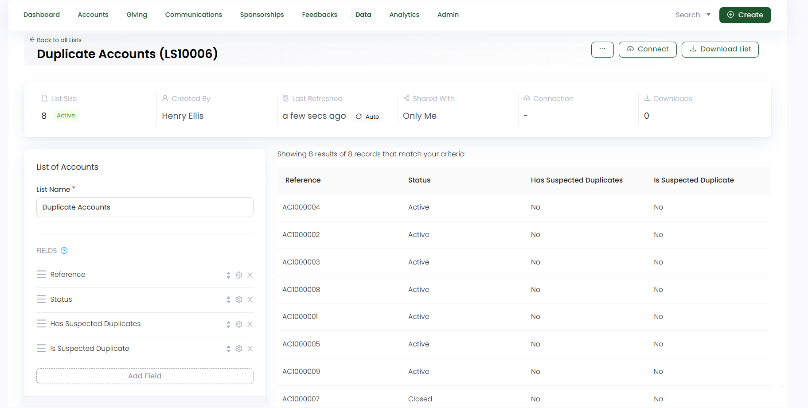

Duplicate donor records occur when the same individual or organization appears more than once in a charity’s CRM system, often with slightly different information. Hence, with multiple people managing the donor information in the system, these duplicate records can lead to poor donor experience (donors may receive duplicate emails or incorrect acknowledgments) and inefficiency.

## How Engage Tackles the Duplicate Accounts Problem?

Engage solves the issue of duplicate records by intelligently merging matching donor profiles in the background. It keeps your database clean and current without requiring manual effort. With customizable rules to determine what counts as a duplicate, this tool simplifies your data maintenance, so you can concentrate more on donor engagement.

Hence, some major features that Engage provides are:

**1.** **Scanning** and **identifying** the database for duplicate records based on different criteria such as matching **names**, **addresses**, **email addresses** or **phone numbers**; every **30 days**.

**2.** Then **automatically** merging these duplicate records without interrupting your existing workflow.

**3.** Updated **list** that includes all identified duplicates and refreshes every few hours to give information for accounts that are being merged.

## Criteria to Match Searched Accounts in Engage

The general criteria to match a searched account in Engage is based on:

1. **Type** of the account
2. **Name** of the account (includes individual name (first & last name), organization name or contact name as a single entity)
3. **Email** of the account
4. **Telehphone** of the account
5. **Address** of the account

This means that if any of the above matches while searching for a duplicate account, then that account must be merged. For e.g., *an account with "ID: AC1000072", while being searched, has another account with "ID: AC1000075" and a similar "individual name" and "email address".*  

For the **Auto Merge feature**, we have multiple **conditions** for matching and merging, set within the Engage CRM. 

**1.** **Everything Matches:** The account type, name, email, telephone, and address, all matches with the searched account.

**2.** **Name and Address and Email Match:** The account name, address and email matches with the searched account only. E.g. *an account with "ID: AC1000087", while being searched, has two accounts with "ID: AC1000079" & "ID: AC1000056" and a similar "individual name", "full address" and "email".*

**3.** **Name and Address and Telephone Match:** The account name, address and telephone number matches with the searched account only.

**4.** **Name and Postal Code and Email Match:** The account name, postal code and email matches with the searched account only. E.g. *an account with "ID: AC1000033", while being searched, has another account with "ID: AC1000074" and a similar "individual name", "postal code", and "email".*

**5.** **Name and Postal Code and Telephone Match:** The account name, postal code and telephone number matches with the searched account only.

**6.** **Name and Address Line 1 and Email Match:** The account name, address (only line 1) and email matches with the searched account only. E.g. *an account with "ID: AC1000064", while being searched, has two accounts with "ID: AC1000079" & "ID: AC1000056" and a similar "individual name", "line 1 address" and "email".*

**7.** **Name and Address Line 1 and Telephone Match:** The account name, address (only line 1) and telephone number matches with the searched account only. E.g. *an account with "ID: AC1000087", while being searched, has two accounts with "ID: AC1000079" & "ID: AC1000056" and a similar "individual name", "line 1 address" and "telephone number".*

**8.** **Name and Address Line 1 and Postal Code Match:** The account name, address (only line 1) and postal code matches with the searched account only.

**9.** **Name and Email and Telephone Match:** The account name, email and telephone number matches with the searched account only.

**10.** **Name And Email Match:** The account name and email matches with the searched account only. E.g. *an account with "ID: AC1000087", while being searched, has another account with "ID: AC1000079" and a similar "individual name" and "email".*

## Create a List to View Duplicates

According to point number 3, you can create your own list to identify the possible duplicates in Engage.

:::tip
To view detailed information on lists, visit our <K2Link route="docs/engage/data/lists/" text="Lists Documentation" isInternal/> in the Engage section.
:::

**1.** Navigate to **Lists** under **Data** in the main menu. Create an **accounts** type list and name it.

**2.** Under **Fields** section, click **Add Field** to add multiple different fields to the list. In this case, following fields are important to view the possible duplicate records. You can choose to add filters to the list fields if you prefer.

- **Reference:** Unique reference of the account.
- **Status:** Status of the account as active or closed.
- **Has Suspected Duplicates:** Indicates if the account has suspected duplicates or not.
- **Is Suspected Duplicate:** Indicates if the account itself is a suspected duplicate of another account or not.
- **Suspected Duplicates:** A list of suspected duplicates and the manner in which they matched.

**3.** Remember to set the list the list to **auto-refresh** to make sure duplicate accounts emerge every few hours, if any. Click the **three dots (...)** and select **Enable Auto Refresh**.

