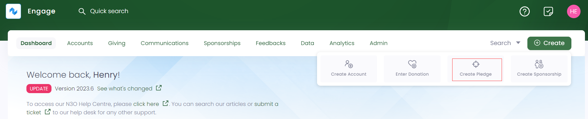
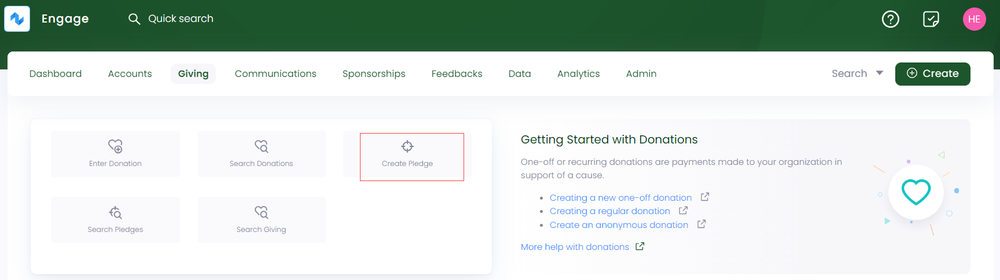
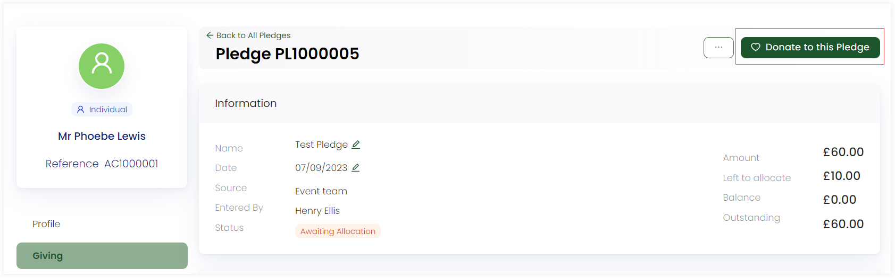

A pledge is a formal promise or commitment made by an individual or organization to contribute a specified amount of money in support of a cause or charity.

In Engage, an account can create a new pledge or [donate to an existing pledge](#donating-to-a-pledge).  

:::note
To avoid any duplicate pledges and their problems, first search for a pledge within Engage.
:::

## Option 1: Create a Pledge via Create

- On the <K2Link route="dashboard" text="Engage dashboard" isEngage />, click the **Create** button. A bar containing different icons will be shown.

- Click the **Create Pledge** button. This will take you to create a pledge screen.

:::note
By default, a pledge will be processed as *anonymous*. You can select **Change Account** to associate a pledge with a specific account. 
:::

## Option 2: Create a Pledge via Giving Dashboard

- On the <K2Link route="giving" text="Giving dashboard" isEngage />, navigate to **quick navigation**.

- Click on **Create Pledge** and a screen will appear to create a pledge.

## How to Create a Pledge in Engage?

1. In the *information* section, select the **Date**. By default, current date is displayed.

2. **Name** the pledge whatever you want and choose the **Source**, whether *internal* or *3rd Party*. 

:::note
Internal sources are managed by your system administrator.
:::

3. Choose **Enable Allocations** as yes or no. If yes, then an *Allocations* section appears, where you can allocate funds, existing sponsorships, or feedbacks to the pledge. You can also add extra amount in the *Allocate Later* text box and the total amount is shown at the bottom right. 

4. Lastly, if you want to associate tasks, select yes or otherwise no. When all the information is added, click **Create**.

## Donating to a Pledge

:::note
- For donations referring to specific pledges, each *allocation* added, whether funds or sponsorships, includes a small clickable note saying *Towards Pledge - Pledge Reference Number* and leads to the detailed actual pledge.  
- Pledges are created with advance allocated payments and can be used for both single and regular donations, with the amount deducted from the pledge payment.
:::

You can donate to a specific pledge right after its creation, therefore, first create a pledge, click **Donate to this Pledge** and then follow the steps explained in the create one-off donation or create regular donation documentation. 

You can also view any existing pledge from an account's giving profile by clicking the *pen icon* or search for an existing pledge and click the **Donate to this Pledge** option to donate to the pledge. 

