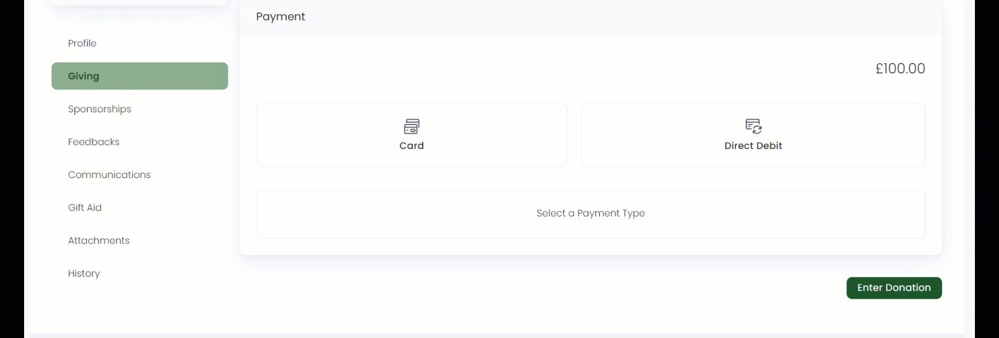

Payments within a CRM are integral to an organization's financial operations, customer relations, and fundraising efforts. They refer to the various ways that customers or donors can make payments to an organization. **Engage** supports different payment types including:

1. Credit/Debit Card Payments
2. Bank Transfers
3. Check/Cash Payments
4. Agency Payment Models 
5. Direct Debit

Each payment type has different payment methods that can be added by your system administrator for you. Each payment method can be added, activated or deactivated, having different fields to be filled up, according to use.

:::note
Payment methods must be configured by your system administrator before making a donation.
:::

## Adding Payment Methods While Making Donations

:::note
Single donations include all the payment types, but regular donations include *card* and *direct debit* only.
:::

While making single or regular donations, there is a separate *Payment* section at the end.

### Single donations

1. Select any payment type for e.g. *Agency Income*.
2. Select the *Payment Service Provider*. This includes all the payment methods that the system administrator has added for you for the particular selected payment type.
3. Each payment method requires different fields to be covered with *Payment date* as a similar field for all. For e.g. *Givebrite* has *Givebrite Charge ID*, *Receipt Book Number* and *Received by* fields. 
4. Each payment can be made in *full* or *other amount* as needed.

### Regular Donations

1. Select a payment type, *Card* or *Direct Debit*.
2. Select the *Payment Service Provider*. This includes all the payment methods that the system administrator has added for you for the particular selected payment type.
3. Each payment method requires different fields to be covered. For e.g. *Card* has *Cardholder Name*, *Card Expiry*, *Number* etc.
4. Each payment method has a *Regular Payment Options* section to be filled up. 

| Options | Description |
| ------- | ----------- |
| Payment Given | Paying the regular donation as **annually, monthly, quaterly or weekly**. |
| Usual Collection Day | Which day of the month should payments ordinarily be taken. |
| First Payment Date | The very first payment may be taken on a different date of the month to the usual collection day, if desired. By default, the first payment date is displayed as the current date. |  

