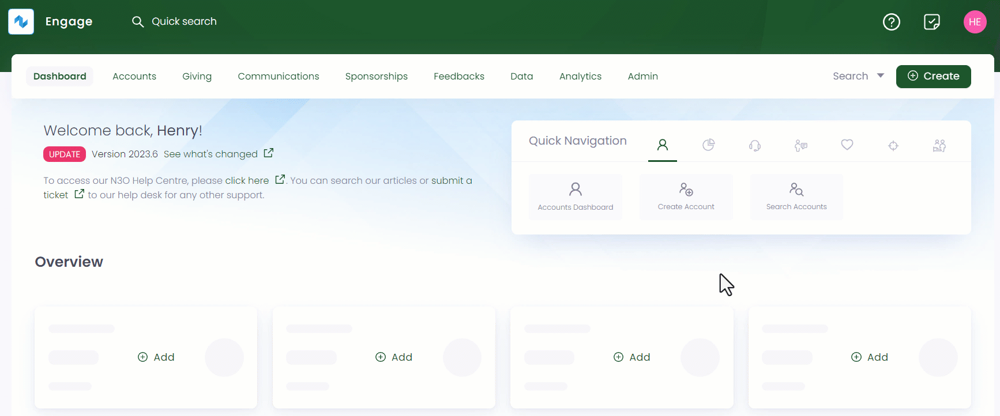

An account can search for all existing regular giving donations separately within Engage via a dedicated **advanced search screen**. The advanced search option allows you to search for an existing donation with the help of different parameters for e.g. giving reference, status, or payment methods etc.   

The advanced search screen is made up of a *Filters* panel on the left which you can collapse, and a *results* section on the right.

1. On the <K2Link route="dashboard" text="Engage dashboard" isEngage />, click the **Search** button next to **Create**. Choose the type of search you wish to perform, in this case, **Giving**.

:::tip
Regular giving donations can be searched via the **Search Giving** option in the quick navigation section of the *Giving dashboard* as well. 
:::

2. In the **Filters** panel, you can modify the search by specifying input parameters accordingly. Click the **"+"** icon next to each parameter defined in the table below.

:::note
- **Credentials** under the giving parameter are related to the Card and Direct Debit payments. Each regular giving donated via a card/direct debit includes a different reference number, card number and expiry date. 
- The dates/times under the **Created/Updated** parameter are relative to the time the user has set on their account.
:::

| Parameter Types | Description |
| --------------- | ----------- |
| Keyword | Specify any keyword e.g. any existing regular giving reference. |
| Account | Specify whether account is anonymous or provide the account *reference* or *name*. |
| Giving | Input the giving reference, credential reference/expiry, amount of regular giving made, giving status or the payment method used. |
| Commitment | Input the regular payment options including frequency (annually, quarterly etc.), collection date and day. |
| Created/Updated | Specify created by (account name) or only the *From Date* or the *To Date* and do not need to specify both. For example, *From Date: 1 hour ago* with *To Date: nothing* would show regular giving made in the last hour only. You can also input the time at which the donation was entered. |
| Imported/Matched |  |

4. Click the **Search** button and the results are loaded *"one page"* at a time on the right. Use a **Load More** button at the bottom of the result list to get further results

:::tip
If you wish to remove the search input for all parameters and start all over again, use the **Reset All** option. 
:::