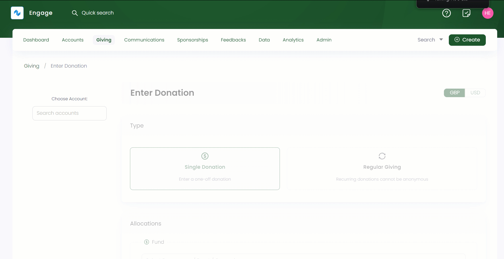
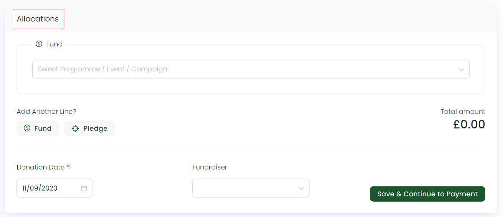

An account in Engage can make a regular giving/recurring donation via quick search or the *Giving dashboard*. Follow the steps explained below to make a regular donation.

1. On the <K2Link route="giving" text="Givig dashboard" isEngage />, in the *quick navigation box*, click **Enter Donation** or use the **Create** button to enter donation.

:::note
You can also search an account and click *Enter Donation* on its main profile page.
:::

2. Search for an account on the left-hand side. This will take you to the account's *Enter Donation* screen.

3. Choose the type of donation, in this case, *Regular Giving Donation*.

:::note
You can choose the currency you wish to donate in for e.g. GBP, USD, AUD etc. from the drop-down on the top right.
:::

4. In the **Allocations** section, you can specify where you want to make a donation for e.g. towards a fund. As a result, you will refer to the exact program or scheme where you want your donation to be allocated to. 

:::note Important
- If you want to switch from regular to single donation, then allocations already allocated to one donation type will not be transferable to the other.
- You can define more than one allocation for a regular giving donation.
- Each sum of donated money from a regular giving allocation will be totaled and shown as **Total Amount.**  
- You need to complete the allocation's section before proceeding to payment. 
:::

Look at the table below for the different defined allocations which you can make.

| Allocation Types | Functionality |
| ---------------- | ------------- |
| Fund | Funds in Engage are called donation items. You can select any donation item, a *program, event or campaign*, and its fund dimensions including *location, theme* etc. to donate to a fund. |
| Pledge | To add an allocation as a pledge, select the "Pledge" option which opens a *Search Pledges* pop-up screen. Filter and specify to search a pledge or choose any existing pledge from the list. Pledges containing one or more allocations unavailable to any type of giving will appear blur.  Once a pledge is choosen, it appears as **'Towards Pledge - reference number'** in the allocations section. |
| Sponsorship | To add an allocation as a sponsorship, click the down arrow next to *Sponsorship* to either create a new sponsorship or donate to an existing one. |
| Feedback | To add an allocation as a sponsorship, click the down arrow next to *Feedback* to either create a new feedback or donate to an existing one.|

:::info
- Donation items, including their pricing rules, fund dimensions and fundraisers are added and managed by your system administrator.
- Sponsorship and feedback options appear in the *Allocation's section* for those accounts which already have created sponsorships and feedbacks before. 
:::

Next, choose **Fundraiser** and click **Save & Continue to Payment**. 

5. Lastly in the **Payments** section, you can select a payment method including *card* and *direct debit* etc. Each method is clickable and includes different fields to be covered. As soon as payment is completed, click **Enter Donation**. 

:::note
- Payment methods are added and managed by your system administrator.
- Regular donations can be paid with only *Card* and *Direct Debit*.
- Donations whose payment has not been completed comes under the *awaiting payment status*. 
:::

For each regular giving payment method, you will need to choose *regular payment options*, which include:

- Paying the donation amount *annually, monthly, quaterly or weekly*.
- Usual collection day of the donation amount for e.g. *Monday, Tuesday, Wednesday or Thursday* if an account choose to donate weekly.
- First payment date of the donation.

