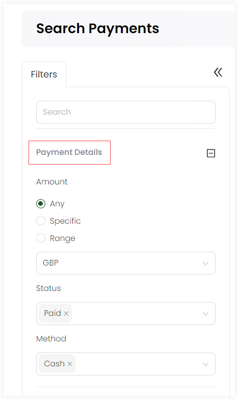
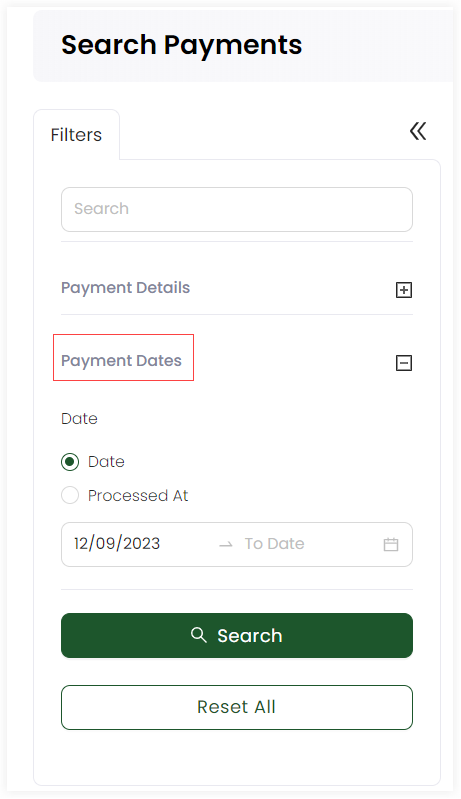

In Engage, an account can search for all types of payments made while making single or regular giving donations via the **advanced search** option. 

The advanced search function is a detailed search option which gives you the leverage to search for any specific type of payment. You can search for payments that are completed, failed to process or canceled. The advanced search screen is made up of a **Filters** panel on the left which you can collapse, and a **results** panel on the right.

1. On the <K2Link route="dashboard" text="Engage dashboard" isEngage />, click the **Search** button next to **Create**. Choose the type of search you wish to perform, in this case, **Payments**.

2. In the **Filters** panel, you can modify the search by specifying different input parameters. Click the **"+"** icon next to each parameter defined below and search accordingly.

| Payment Details (Parameters) | Description |
| ---------- | ----------- |
| Amount | Payment amount can be specified as any, a certain amount or in a specific range along with the currency to be chosen. |
| Status | The status of the payment as error, cancelled, declined or complete etc. |
| Method | The payment method through which the payment was made. |

:::note
- The dates/times in the **Payment Dates** section are relative to the time the user has set on their account.
- You can specify only the *From Date* or the *To Date* and do not need to specify both.
:::

Payment dates can be specified as:

1. Only *to and from* dates of a certain payment made.
2. Both *to and from* dates and the payment processing time of a payment. 

3. Click the **Search** button and the results are loaded *"one page"* at a time on the right. Use a **Load More** button at the bottom of the result list to get further results.

:::tip
If you wish to remove the search input for all parameters and start all over again, use the **Reset All** option. 
:::