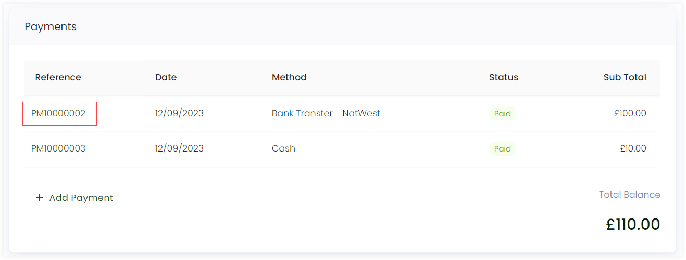
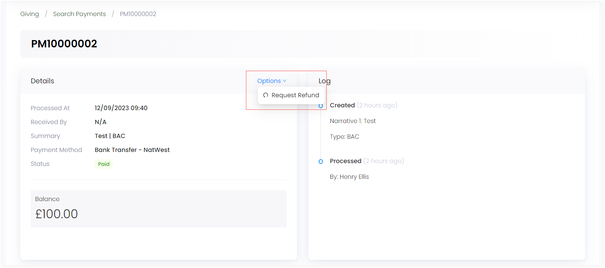
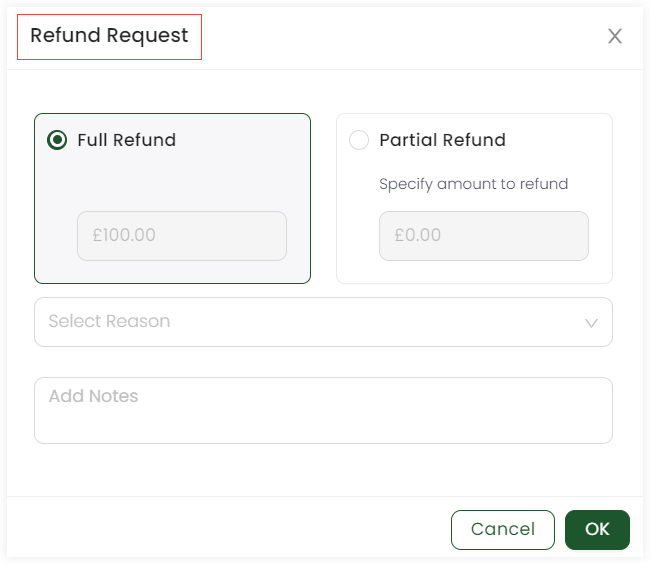
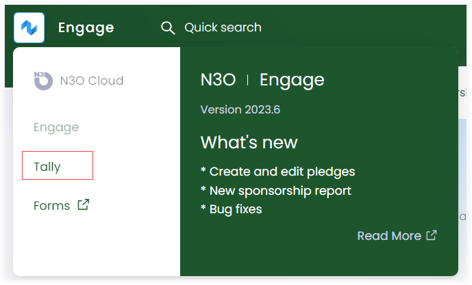
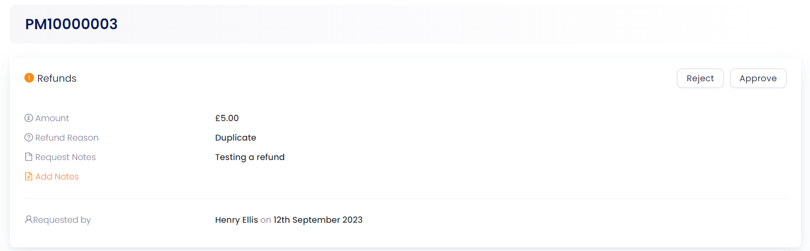

Refund is the process of reimbursing a customer, or donor for a previous payment. It is essential in managing payments as it allows for the correction of errors, resolution of disputes, and the maintenance of customer satisfaction.

## Why are Refunds Important?

1. **Error Correction:** Refunds allow organizations to rectify billing errors or mistakes promptly. This is important for maintaining trust and credibility.

2. **Customer Retention:** Managing refunds effectively can lead to improved customer retention. Customers who experience a smooth and fair refund process are more likely to continue doing business with an organization.

3. **Dispute Resolution:** Refunds can help resolve disputes and conflicts between organizations/individuals and customers or donors. They provide a mechanism for addressing issues and finding amicable solutions.

## Requesting a Refund in Engage

In Engage, an account can make a refund request for any payment made via a payment method.

:::note
Refund request is requested within Engage and approved in **Tally** by the system administrator. 
:::

1. Go the **Giving** section in the accounts profile menu and scroll down to the donation *Records* section. Select any donation and click its *reference number*.

:::note
You can also search for any existing payment via the advanced search option to refund.
:::

2. In the *Payments* section, select any payment and click its *reference number*. The payment screen will appear.

3. In the *Details* section, click **Options** and select *Request Refund*.

4. Select whether you want a *full refund* or a *partial refund*. In case of partial refund, specify the amount to refund. Choose the reason, add any notes, and click **OK**. 

:::note
- As soon as you click OK, the *Refund status* under the *Details* section would show **Awaiting Approval**.
- You can also see the refund created in the *Refund* tab under the *Log* section. 
:::

## Approving a Refund in Tally

1. Click on Engage in the top left corner and select **Tally**. 

2. Click *Payments* in the navigation menu or click *Search* + select *Payment* and search for the payment whose refund was requested.

:::tip
To search for the specific payment, you can copy the payment reference whose refund was requested in Engage and paste it in the keyword section of searching payments in Tally.
:::

3. Open the payment details. You will see a **Refunds!**, **Details** and **Log** section. Each amount refunded would show a separate section. Ask your system administrator to approve the refund request. 

:::note
Refund request is approved after selecting a method and adding notes in the *Approve Refund Request* prompt screen.
:::

4. As soon as the request is approved by the system administrator, an *Approved* text would show in the **Refunds!** section along with a *refunded* status in the *Details* section. Also, you can click the *Donation reference* related to the payment refund and view donation details related to the refunded amount, balance and outstanding amount etc. 

:::note
You can also view the logs of the refund processed by clicking on *Refund* in the *Logs* section. 
:::