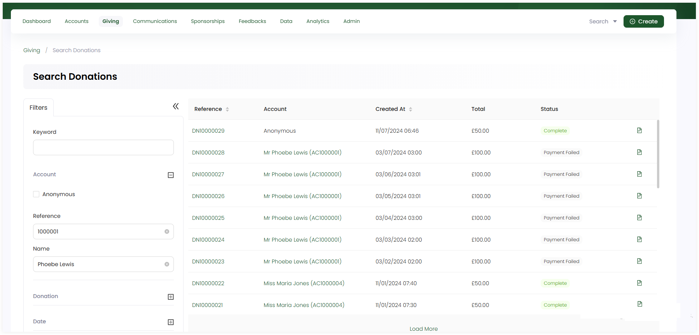

Searching donations is a regularly used action in a CRM. Engage makes this very easy with:

- A **quick search box** available in the header allowing you to quickly search for a donation by **reference**.

- A dedicated **advanced search screen** for advanced and complex searches, such as recently modified donations, which account donated or when was the donation made.

This article will walk you through how to search for existing donations.

## Using Global Search

1. On the <K2Link route="dashboard" text="Engage dashboard" isEngage />, click the quick search box in the header. If the search scope is not already set to **Donations**, change this from the dropdown on the right.

2. Input the search query and select the desired search result. For example, type the reference of a donation.

 

:::note Important
- You can either search by the **primary reference** assigned to a donation or any secondary references for e.g. skipping the **DN prefix** in the reference number.
- If no results are found for a certain search input, then it could be because the donation does not exist, or it might have been canceled.
:::

## Using Advanced Search

The advanced search function is a detailed search option that allows you to search for any existing donations created on certain dates, for a sum of money, or through a specific account.

The advanced search screen is made up of a **Filters** panel on the left which you can collapse, and a **results** section on the right.

1. On the <K2Link route="dashboard" text="Engage dashboard" isEngage />, click the **Search** button next to **Create**. Choose the type of search you wish to perform, in this case, **Donations**.

:::tip
- You can also click **Search Donations** in the quick navigation section of the *Giving dashboard* to search for donations via the advanced option. 
- Regular giving donations are searched separately via the **Search Giving** option in the quick navigation section on the **Giving dashboard**. 
:::

2. In the **Filters** panel, you can modify the search by specifying input parameters accordingly. For e.g., you can specify any keyword to view a specific donation, enter account information which made the donation or input the donation date of when the donation was made like today, this week etc. 

Click the **"+"** icon next to:

- **Account** and search via **reference** or **name** of the account that created the donation or tick mark **anonymous**. 
- **Donation** and search via **reference**, **Total** sum of money donated, **Status** and **Type**. 
- **Date** and input the dates in the **Created** parameter.

3. Click the **Search** button and the results are loaded "one page" at a time on the right. Use a **Load More** button at the bottom of the result list to get further results.

:::tip
- If you wish to remove the search input for all parameters and start all over again, use the **Reset All** option. 
- If you need a list of all the accounts(donors) that made donations, donations made in specific months, etc. use the **lists** function.
:::