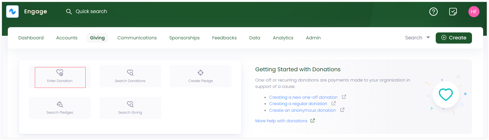

In Engage, donations can be made by separate individuals or organizations in support of any charitable cause. This article will walk you through the methods of landing on the donation starting point, i.e., the **Enter Donation** screen.

## Method 1: Via Engage Dashboard

- On the <K2Link route="dashboard" text="Engage dashboard" isEngage />, click the **Create** button. A bar containing different icons will be shown.

- Click the **Enter Donation** button. This will take you to enter donation screen.

:::tip
You can also click **Enter Donation** in the **Quick navigation** section on the dashboard to navigate to the enter donation screen.

:::

## Method 2: Via Giving Dashboard

- On the <K2Link route="giving" text="Giving dashboard" isEngage />, navigate to **quick navigation**.

- Click on **Enter Donation** and navigate to the enter donation screen.

## Method 3: Via an Accounts Profile

1. <K2Link route="docs/engage/accounts/searching-accounts/" text="Search for an account" isInternal/> you wish to enter a donation for. 

2. On the accounts main profile page, click **Enter Donation** to navigate to the enter donation screen.

