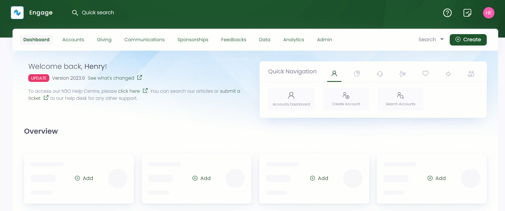
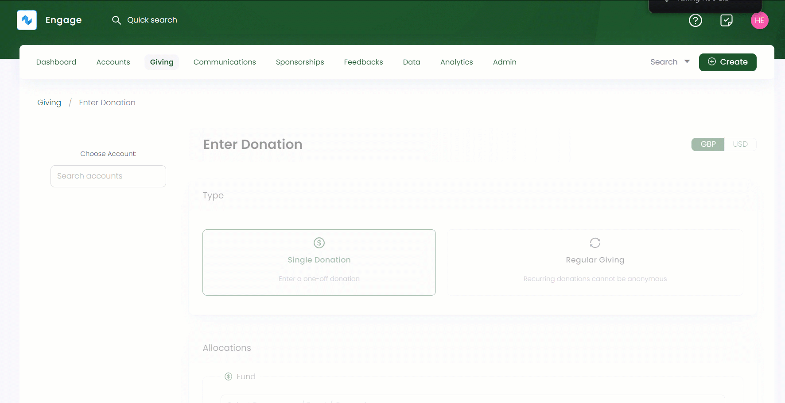

To create a single donation, go through the following steps.

1. On the <K2Link route="giving" text="Giving dashboard" isEngage />, in the quick navigation box, click **Enter Donation** or use the **Create** button to enter a donation.

2. Search for the account on the left-hand side. This will take you to the account's **Enter Donation** screen.

3. Choose the type of donation, in this case, **Single Donation**.

:::note
You can choose the currency you wish to donate in for e.g. GBP, USD, AUD etc. from the drop-down on the top right.
:::

4. In the **Allocations** section, you can specify where you want to make a donation for e.g. to an existing beneficiary. As a result, you will refer to the exact program or scheme where you want your donation to be allocated to. 

:::note Important
- If you want to switch from single to regular donation, then allocations already allocated to one donation type will not be transferable to the other.
- You can define more than one allocation for a single donation.
- Each sum of donated money from a single allocation will be totaled and shown as **Total Amount.**  
- You need to complete the allocation's section before proceeding to payment. 
:::

Look at the table below for the different defined allocations which you can make.

| Allocation Types | Functionality |
| ---------------- | ------------- |
| **Fund** | Funds in Engage are called <K2Link route="docs/engage/donations/allocations/donation-items/" text="donation items" isInternal />. You can select any donation item, a program, event or campaign, and its fund dimensions including location, theme etc. |
| **Pledge** | To add an allocation as a pledge, select Pledge which opens a **Search Pledges** pop-up screen. Filter and specify to search a pledge or choose any existing pledge from the list. Pledges containing one or more allocations unavailable to any type of giving will appear blur. Once a pledge is chosen, it appears as **'Towards Pledge - reference number'** in the allocations section. |
| **Sponsorship** | To add an allocation as a sponsorship, click the down arrow next to **Sponsorship** to either create a new sponsorship or donate to an existing one. |
| **Feedback** | To add an allocation as a sponsorship, click the down arrow next to **Feedback** to either create a new feedback or donate to an existing one.|

:::info
- Donation items, including their pricing rules, fund dimensions and fundraisers are added and managed by your system administrator.
- Sponsorship and feedback options appear in the Allocation's section for those accounts which already have created sponsorships and feedbacks before. 
:::

5. Select the **Donation Date** (only for single donation), **Fundraiser** and click **Save & Continue to Payment**. 

6. Lastly in the **Payments** section, you can select any payment method including bank transfer, card, cash & cheque etc. Each method is clickable and includes different fields to be covered. As soon as payment is completed, click **Enter Donation**. 

:::note
- Payment methods are added and managed by your system administrator.
- You can donate either in **Full Amount or Other Amount** for single donations, which can be entered in the emerged **Amount** text box.
- Single donations can be paid with all the payment methods available.
- Donations whose payment has not been completed come under the **awaiting payment status**. 
- You can also save your card details for any next payment by ticking the checkbox **Save the card**.
:::

