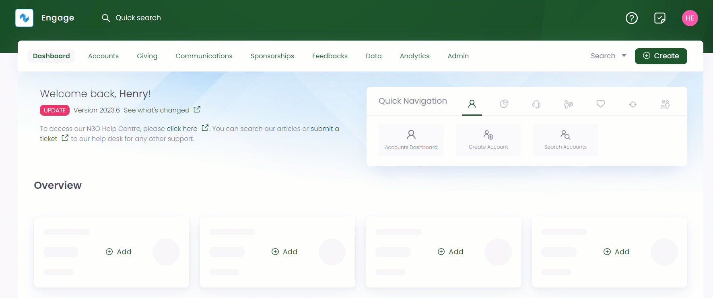
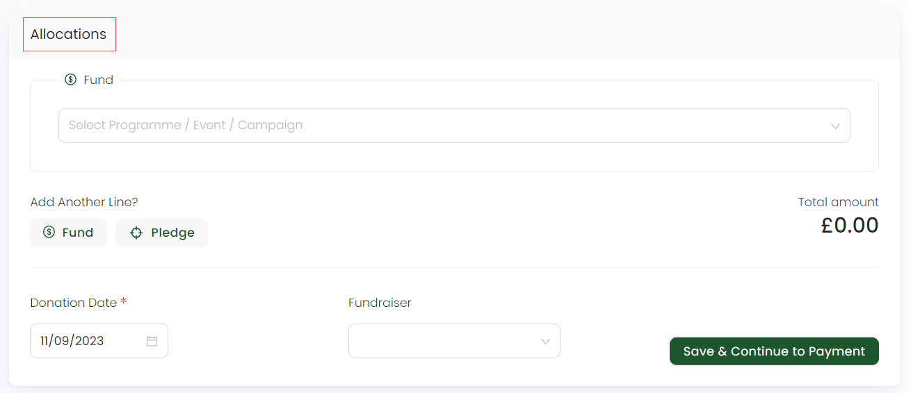
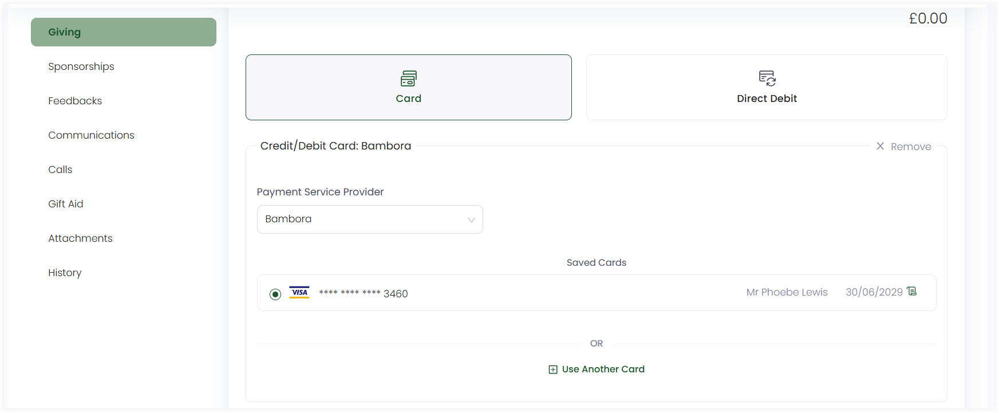
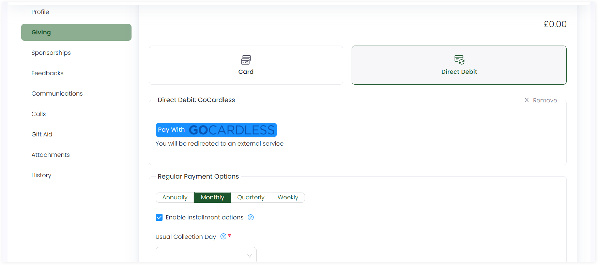
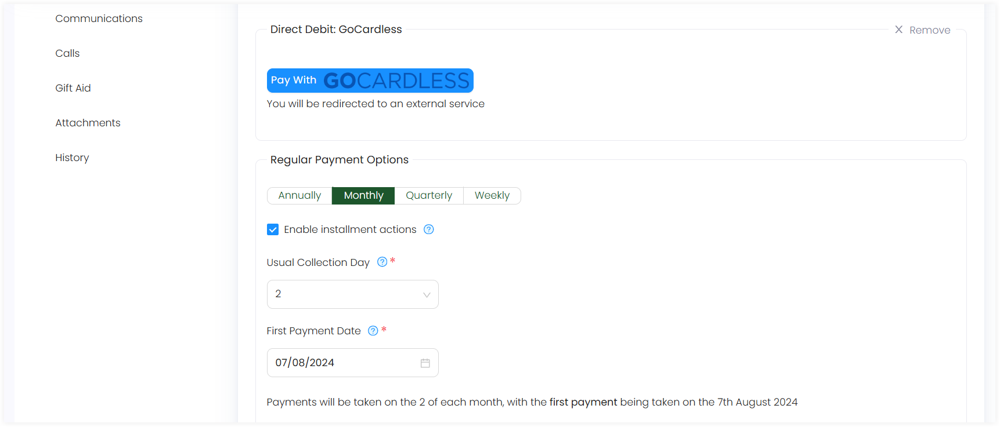

To create a regular giving donation, follow the steps explained below.

1. On the <K2Link route="giving" text="Giving dashboard" isEngage />, in the *quick navigation box*, click **Enter Donation** or use the **Create** button to enter donation.

:::tip
You can also search a specific account and create a regular giving for that account on its main profile page.
:::

2. Search for an account on the left-hand side. This will take you to the account's *Enter Donation* screen. 

3. Choose the type of donation, in this case, *Regular Giving Donation*.

:::info
- Regular givings are not created as **anonymous**.
- You can choose the currency you wish to donate in for e.g. GBP, AED, AUD etc. from the drop-down on the top right.
:::

4. In the **Allocations** section, specify where you want to make a donation, for example, towards a fund or a certain pledge. As a result, you will refer to the exact program or scheme where you want your donation to be allocated to. 

:::note Important
- If you want to switch from regular to single donation, then allocations already allocated to one donation type will not be transferable to the other.
- You can define more than one allocation for a regular giving donation.
- Each sum of donated money from a regular giving allocation will be totaled and shown as **Total Amount.**  
- You need to complete the allocation's section before proceeding to payment. 
:::

Look at the table below for the different defined allocations which you can make.

| Allocation Types | Functionality |
| ---------------- | ------------- |
| **Fund** | Funds in Engage are called donation items. You can select any donation item, a *program, event or campaign*, and its fund dimensions including *location, theme* etc. to donate towards it. |
| **Pledge** | To add an allocation as a pledge, select the "Pledge" option which opens a **Search Pledges** pop-up screen. Filter and specify the required parameters to search a pledge or choose any existing one from the list. Pledges containing one or more allocations unavailable to any type of giving will appear blur. Once a pledge is choosen, it appears as **'Towards Pledge - reference number'** in the allocations section. |
| **Sponsorship** | To add an allocation as a sponsorship, click the **down arrow** to either create a **new** sponsorship or donate to an **existing** one. |
| **Feedback** | To add an allocation as a sponsorship, click the **down arrow** to either create a **new** feedback or donate to an **existing** one.|

:::info
- Donation items, including their pricing rules, fund dimensions and fundraisers are added and managed by your system administrator.
- Sponsorship and feedback options appear in the allocation's section for only those accounts which have existing sponsorships and feedbacks. 
:::

5. Choose **Fundraiser**, if required, and click **Save & Continue to Payment**. 

6. In the **Payments** section, select a payment method, either **card** and **direct debit** etc. Each method is clickable and includes different fields to be covered. As soon as payment is completed, click **Enter Donation**. 

For **card**:

Select the payment service provider, choose an existing saved card or add a new one by adding all the required details including cardholder name, number etc.

For **direct debit**:

Click on **Pay with Gocardless** which will redirect you to an external Gocardless service where you can set up the direct debit and fill up the required information.

:::note
- Payment methods are added and managed by your system administrator.
- Regular donations can be paid with only **Card** and **Direct Debit**.
- Donations whose payment has not been completed and saved for internal purposes come under the **awaiting payment status**. 
:::

For each payment method, you will need to choose the **Regular Payment Options**, including:

- Paying the donation amount **annually**, **monthly**, **quaterly** or **weekly**.
- Tick marking the **Enable installment actions** checkbox if needed, to generate a correspondence such as a receipt each time a donation is collected.
- **Usual collection day** of the donation amount refering to the day of the month the payments would be collected on.
- **First payment date** of the donation, in case a different date is needed other than the usual collection day.

