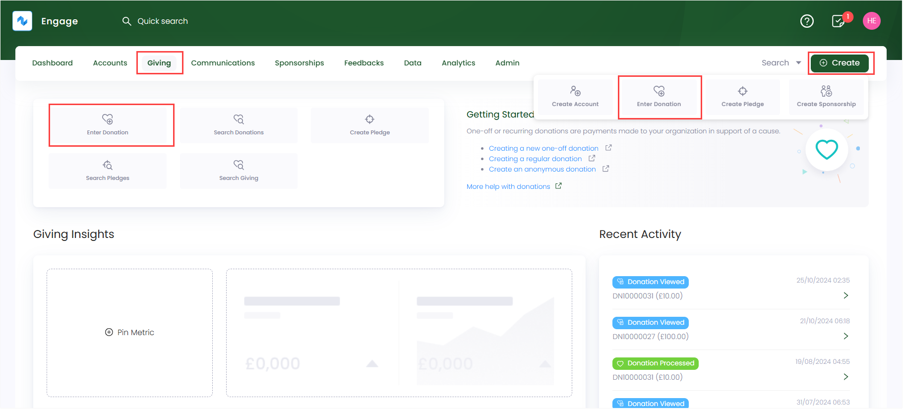
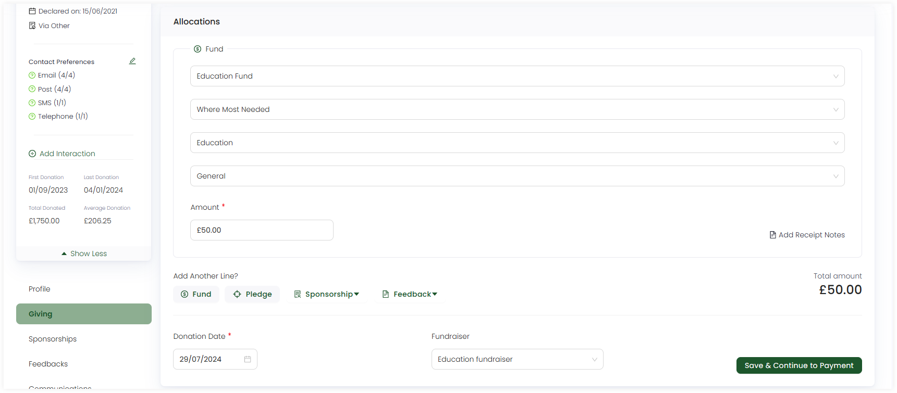
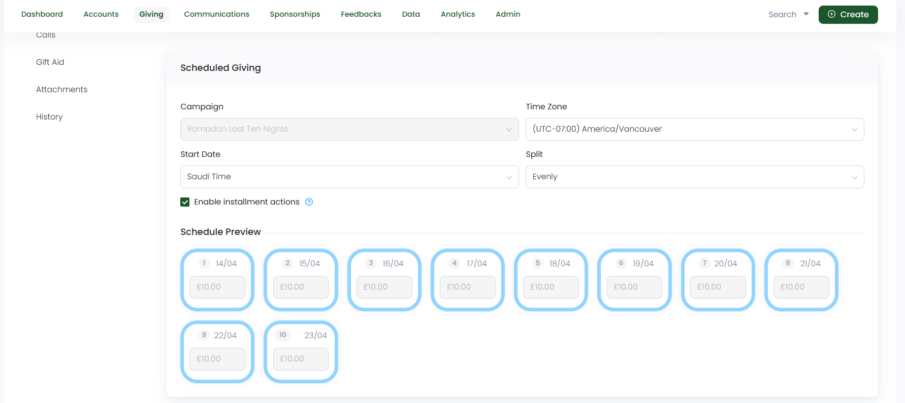
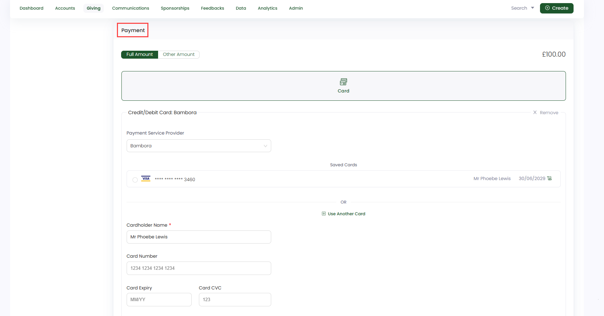

To create a scheduled giving, go through the following steps.

**1.** On the <K2Link route="giving" text="Giving dashboard" isEngage />, in the *quick navigation box*, click **Enter Donation** or use the **Create** button to enter donation.

:::tip
- You can also search a specific account and create a scheduled giving for that account on its main profile page.
- Scheduled givings are not created as **anonymous**.
:::

**2.** Search for an account on the left-hand side. This will take you to the account's *Enter Donation* screen. 

**3.** Choose the type of donation, i.e., *Scheduled Giving*.

:::note
You can choose the **currency** you wish to donate in for e.g. *GBP or EUR* on the top right, but the default is set to **GBP**.
:::

**4.** In the **Allocations** section, specify the allocation towards which you will be donating, e.g., a **fund, pledge, sponsorship**, or **feedback**. By default, a fund is shown. Also, choose a **fundraiser**, if required.

:::note Important
- If you want to switch from scheduled giving to other donation type, then allocations already allocated to previous donation type will not be transferable to the next.
- You can define more than one allocation for a single scheduled giving.
- Each sum of donated money from a regular giving allocation will be totaled and shown as **Total Amount.**  
- You must complete the **Scheduled Giving** section before proceeding to payment. 
:::

Look at the table below for the different defined allocations which you can make.

| Allocation Types | Functionality |
| ---------------- | ------------- |
| **Fund** | Funds in Engage are called <K2Link route="docs/engage/donations/allocations/donation-items/" text="donation items" isInternal />. You can select any donation item, a *program, event or campaign*, and its fund dimensions including *location, theme* etc. to donate towards it. |
| **Pledge** | To add an allocation as a pledge, select the "Pledge" option which opens a **Search Pledges** pop-up screen. Filter and specify the required parameters to search a pledge or choose any existing one from the list. Pledges containing one or more allocations unavailable to any type of giving will appear blur. Once a pledge is choosen, it appears as **'Towards Pledge - reference number'** in the allocations section. |
| **Sponsorship** | To add an allocation as a sponsorship, click the **down arrow** to either create a **new** sponsorship or donate to an **existing** one. |
| **Feedback** | To add an allocation as a sponsorship, click the **down arrow** to either create a **new** feedback or donate to an **existing** one.|

:::info
- Donation items, including their pricing rules, fund dimensions and fundraisers are added and managed by your system administrator.
- Sponsorship and feedback options appear in the allocation's section for only those accounts which have existing sponsorships and feedbacks. 
- You can also manually add an attribution to the donation, if you want to.
:::

**5.** Moving onto the **Scheduled Giving** section; 

- Select the **campaign (towards which the donation would be scheduled for)**, **timezone**, **start date (date on which the scheduled donation would start)** and **split process** as saved for the campaign. 
- As soon you choose a split, a **Schedule Preview** pops up with the **number of days, date** and the **amount**. 
- Tickmark **Enable installment actions** if you want to generate a correspondence such as a receipt each time a donation is collected.

:::tip
You can also select the **splits** as **custom** and define the **schedule preview** according to your preference. 
:::

**6.** In the **Payments** section, select the payment method as **card**. Select the **payment service provider**, choose an existing saved card or add a new one by adding all the required details including **cardholder name**, **number**, **expiry date**, **CVC** etc. As soon as payment is completed, click **Enter Donation**.

:::note
- Payment methods are added and managed by your system administrator.
- Scheduled donations can be paid with only **Card**.
- Donations whose payment has not been completed and saved for internal purposes come under the **awaiting payment status**. 
:::

