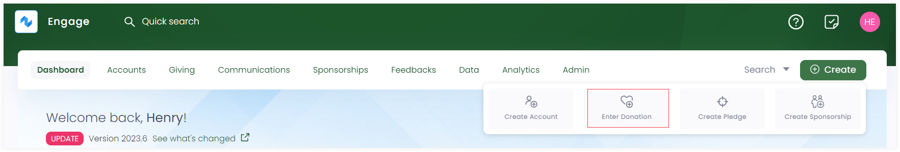
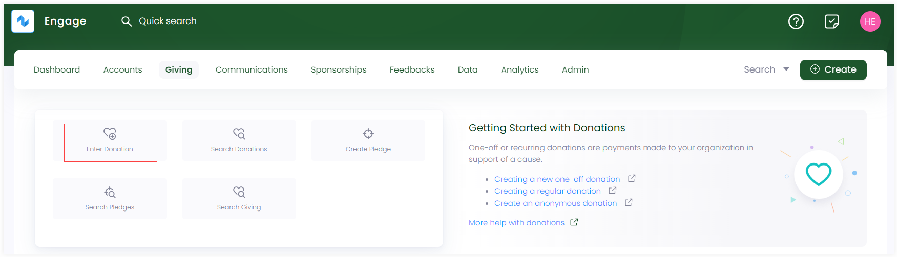

In Engage, donations can be made by separate individuals or organizations in support of any charitable cause. This article will walk you through the steps of the starting point of donations i.e. landing onto the *"Enter Donation"* screen. 

To read more about how to create different donations, go to create single, regular or anonymous donations documentation.

## Enter a Donation via Dashboard

- On the <K2Link route="dashboard" text="Engage dashboard" isEngage />, click the **Create** button. A bar containing different icons will be shown.

- Click the **Enter Donation** button. This will take you to enter donation screen.

## Enter a Donation via Giving Dashboard

- On the <K2Link route="giving" text="Giving dashboard" isEngage />, navigate to **quick navigation**.

- Click on **Enter Donation** and a screen will appear to enter donation.

## Enter a Donation from an Accounts Profile

You can also make a donation from a specific account's profile page. 

1. <K2Link route="docs/engage/accounts/searching-accounts/" text="Search for the account" isInternal/> you wish to enter a donation for. 

2. On the accounts profile or giving page, click **Enter Donation**, next to the **three dots(...)**.

3. An *Enter Donation* screen will appear.

