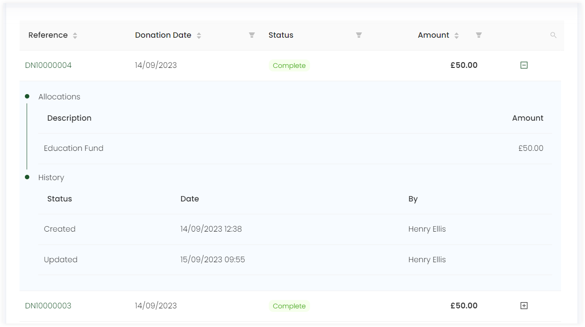

An account can view and edit each and every donation whether single or regular giving. Open up *Giving* in the profile menu within Engage, and you will see:

- All existing regular giving donations in a separate section.
- Records of all existing donations in the form of a list.

## Edit Regular Giving Donations Individually

The **Regular Giving** section contains all existing regular giving donations that are made by the account. Each regular giving includes its status, reference number, amount of donation, payment option opted etc. You can edit any regular donation by clicking on the pen icon on the top. This will take you to the donation page.

For a regular giving donation, you can edit each of the following.

- **Commitment:** Includes the frequency of the donation (monthly, yearly etc.), collection day and first collection date.
- **Credentials:** Contains information about the payment method opted like payment reference, credit card summary and expiry date.
- **Allocations:** Contains the existing allocation added. Further allocations can be added via editing.
- **Donations list:** This includes a list of all the donations related to the particular regular giving. For e.g. a 160 pound monthly donation made by Mr. Phoebe Lewis with status 'payment completed' started on '20-01-2023' and so on.  

## Edit All Types of Donations

The *Giving* page also shows a list of records for all the types of donations (single + regular) made by the account. 

:::note
Regular giving donations will have a symbol at the end of each row indicating its type.
:::

You can view a minimal history of each donation via the **'+'** icon and complete donation details by clicking on its *reference number*. Also, you can edit allocations and payment methods by updating the existing or adding a new one for an existing donation. 

:::tip
If the donation has *awaiting payment or payment failed* status, it can be removed via updating the donation's payment method and paying again.  
:::

