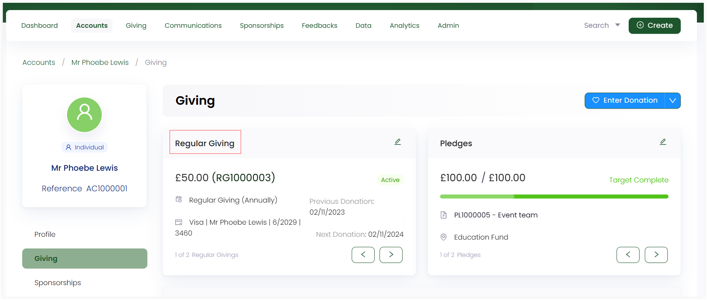

A donor account can edit a donation, single or regular giving, very easily in Engage. Open up the **Giving** section in the profile menu of an account, and you will see:

- All existing regular giving donations and pledges in a separate section.
- All existing donations in the form of a list in a separate section.

:::tip
You can also <K2Link route="docs/engage/donations/searching-donations/" text="search for a donation" isInternal /> or <K2Link route="docs/engage/donations/searching-regular-giving/" text="regular giving" isInternal /> directly and edit it after opening it from there.
:::

## Edit Regular Giving Individually

The **Regular Giving** section contains all existing regular giving donations made by the account. Each regular giving shows its **status**, **amount**, **reference number**, **date of previous and next donation**, and **payment method** opted. Click the **pen icon** and navigate to the detailed regular giving screen to edit and update any information.

On the regular giving screen, click the **pen icon** infront of each of the following and edit as required.

- **Fundraiser:** The fundraising event to raise donations for.
- **Commitment:** Includes the frequency of the donation (monthly, yearly), collection day and first collection date.
- **Credentials:** Contains information about the payment method opted like payment reference, credit card summary and expiry date.
- **Allocations:** Existing allocation added to the donation.

:::tip
- You can view a **donations list** that includes all the donations related to the particular regular giving. For e.g. *a 160 pound monthly donation made by Mr. Phoebe Lewis with status '**payment completed**' started on '**20-01-2023**' and so on*.  
- You can click the **three dots (...)** under the **Details** section and choose to: 

    - Disable the installment actions function which was enabled before. 
    - Pause the regular giving for a while.
    - Cancel the regular giving altogether.
:::

## Edit All Types of Donations

The **Records** section shows a list of all the types of donations (single + regular) created by the account. You can view a minimal history of each donation including allocations and history by clicking the **'+'** icon. Regular giving donations will have a symbol at the end of each row indicating its type.

To edit a donation, click the **donation reference number** and navigate to the donation detail screen. Click the **pen icon** infront of each of the following and update as required.   

- **Donation date:** Date on which the donation was processed.
- **Allocations:** Existing allocation added to the donation.

:::note
If the donation has an **awaiting payment** or **payment failed** status, it can be removed via updating the donation's payment method and paying again.
:::

