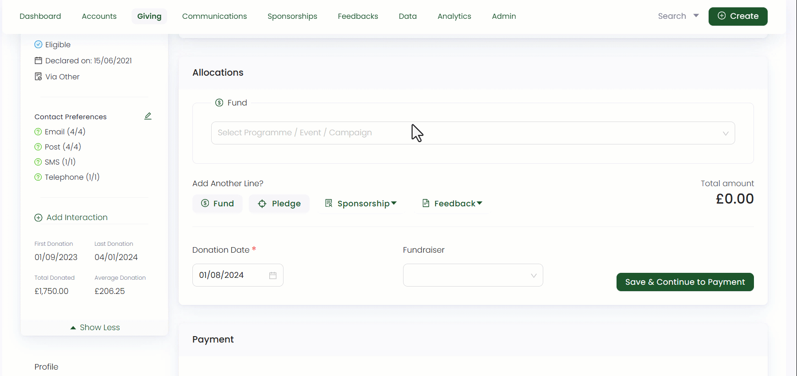

Donation items typically refer to tangible items like specific goods or products that donors contribute to a charity as part of their donations. They help organizations handle donations, maintain transparency, and maximize the impact of contributions by ensuring they reach the intended beneficiaries.

## Why Donation Items are Important for a Charity?

Donation items are essential for several reasons including:

1. **Diverse Contribution Options:** Donation items provide a broader range of contribution options for donors who may prefer giving goods rather than money. This encourages more people to get involved in charitable giving.

2. **Meeting Specific Needs:** Donation items can be tailored to meet the specific needs of beneficiaries. For example, donating winter coats to a homeless shelter during the cold months directly addresses a critical need.

3. **Supporting Immediate Relief:** In disaster relief efforts, donation items like medical supplies, food, and clean water can provide immediate assistance to affected communities.

## Donation Items in Engage

In Engage, donation items are specific projects which are spread across various fund dimensions. They essentially come with pre-defined fund dimensions which ensures that the items are categorized accurately. For e.g. a **donation item (Food Parcel)** may have a **fund dimension (location)** as **Pakistan**.

To add a new donation item, ask your system administrator to do that for you. Once a donation item has been created, an account can add it in the allocations section while making a single donation or a regular giving.

:::note
- A list of all donation items in Engage are managed by your system administrator.
- Before adding a donation item, it is necessary to add fund dimensions.
:::

Donation items as funds may include disaster relief funds, charity funds for schools, orphanages and many other etc. A single donation item has:

| Donation Item (Includes) | Description | 
| ------------------------ | ----------- |
| **Name** | The name of the donation item. |
| **Donation types** | This tells whether the donation item accepts single donation, regular giving or both. | 
| **Tax relief rate** | This refers to the eligibility of tax relief on a certain donation item or not. |
| **Fund dimensions** | The different areas a donation item would be part of. | 
| **Pricing** | The price suggested for a particular donation item. |

:::note Important
Pricing includes a **fixed price** and **advanced pricing rules** for a donation item. 
- **Fixed price** means that the certain pre-set amount needs to be given for a particular donation item. 
- **Advanced pricing** rules allow you to configure different prices for a donation item based on various fund dimensions. Make sure the fund dimensions you choose in the advanced pricing rules are in line with the overall donation item criteria. Otherwise, the system will give an error.
:::