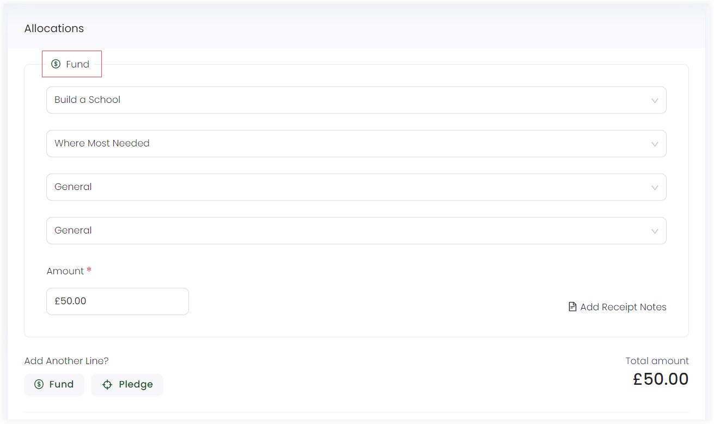

Fund dimensions are an integral part within Engage and allow you to categorize and manage funds or donations according to pre-defined dimension criteria.

:::note
- Fund dimensions are configured and managed by your system administrator.
- While adding a donation item, there is a separate section for allocating fund dimensions to it.
- In some cases, Engage pre-sets certain dimensions during the onboarding process, but they can be modified as per necessary.
:::

## Adding Fund dimensions in Engage

Fund dimensions in Engage have two different options which are:

1. **Restricted Options:** Restricted options refers to adding options to assign funds (donation items) to various specific purposes. 
2. **Unrestricted Options:** Unrestricted options means adding a general option for funds that are not restricted to any of the options mentioned in the restricted area.

:::caution
- Removing or changing fund dimensions will result in certain donation items not working (if they are linked to a fund dimension).
- A fund dimension remains **inactive** and cannot be used until restricted options have been added and activated from the option's menu. 
:::

You can ask your system administrator to add fund dimensions for you before adding a donation item. Fund dimensions may include **location**, **theme**, **stipulation** etc. and can be activated or deactivated according to their usage. 

While making a single or regular giving donation, fund dimensions are added after selecting a donation item in the **Fund** area of the Allocations section. All fund dimensions added by your system administrator appear in the same order while adding a fund.

