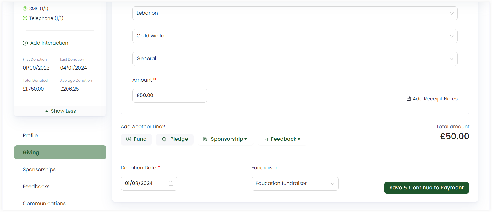

A fundraising event (also called a fundraiser) is an event or campaign whose purpose is to raise money for a cause, charity or non-profit organization. Fundraisers are important for several reasons including:

- **Resource Mobilization:** Fundraisers are the primary drivers of financial support for charitable organisations. They leverage the CRM to identify potential donors, nurture relationships, and secure contributions.

- **Efficiency:** By streamlining donation processing, acknowledgment, and reporting within the CRM, fundraisers ensure that resources are used efficiently and that donors' contributions are put to good use.

- **Donor Retention:** Effective fundraisers use the CRM to engage donors, show appreciation, and communicate the impact of their contributions. This donor-centric approach helps retain supporters and turn them into long-term.

## Fundraiser in Engage

:::note
Fundraisers are configured and managed by your system administrator.
:::

In Engage, an account selects a fundraiser (each with a different name) while adding allocations in a *single* or *regular* donation. If no fundraiser appears in the dropdown, then ask your system administrator to add one for you.

