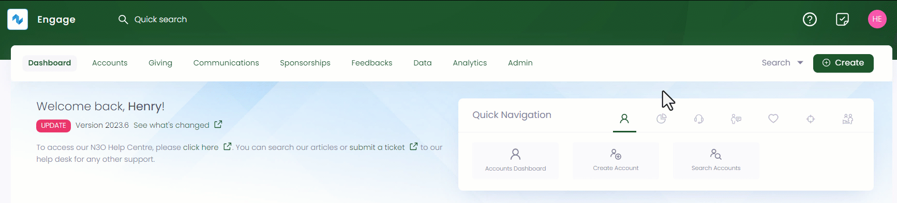
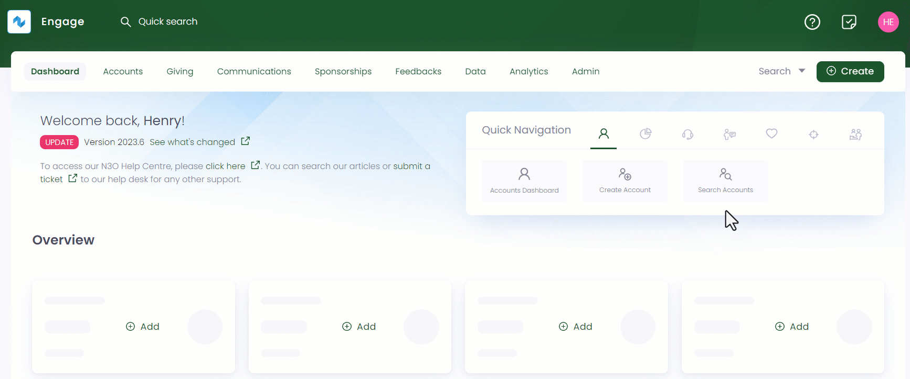
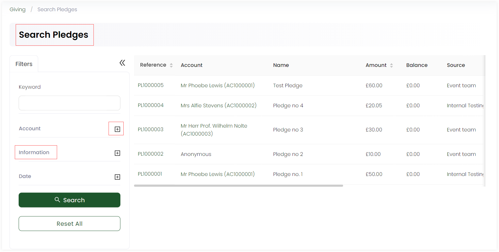

In Engage, an account can search for any existing pledge already created via:

- A **quick search box** available in the header allowing you to quickly search for a pledge by *reference*.

- A dedicated **advanced search screen** for advanced searches, such as recent donations given to a pledge, which account created a pledge or with more complex criteria.

This article will cover all details regarding searching pledges created by different accounts.

## Using Global Search

1. On the <K2Link route="dashboard" text="Engage dashboard" isEngage />, click the quick search box in the header. If the search scope is not already set to **Pledges**, change this from the dropdown on the right.

2. Input the search query and select the desired search result. For example, type the reference of a pledge.

 

:::note Important
- You can either search by the primary reference assigned to a pledge or any secondary references for e.g. skipping the *PL prefix* in the reference number and name of the pledge.
- If no results are found for a certain search input, then it could be because the pledge does not exist, or it might have been deleted.
:::

## Using Advanced Search

The advanced search function is a detailed search option that allows you to search for any existing pledge. You can search for pledges created on specific dates, for a specific donated sum of money, or through a specific account.

The advanced search screen is made up of a **Filters** panel on the left which you can collapse, and a **results** panel on the right.

1. On the <K2Link route="dashboard" text="Engage dashboard" isEngage />, click the **Search** button next to **Create**. Choose the type of search you wish to perform, in this case, **Pledges**.

:::tip
You can also click **Search Pledges** in the quick navigation section of the *Giving dashboard* to search for pledges via the advanced option.  
:::

2. In the **Filters** panel, you can modify the search by specifying input parameters accordingly. For example, you can specify any *keyword* to view a specific pledge, enter *account* information or input the *pledge date*, e.g. *today* or *this week*. 

Going further, click the **"+"** icon next to:

- **Account** and search via **reference** or **name** of the account that created a pledge or tick mark *anonymous*. 
- **Information** and search via **reference**, **name**, **Total** sum of money donated to a pledge, **Status** or **Source**. 
- **Date** and input the from and to dates in the **Created** parameter. The dates are relative to the time the user has set on their account.

4. Click the **Search** button and the results are loaded *one page* at a time on the right. Use a **Load More** button at the bottom of the result list to get further results.

:::tip
- If you wish to remove the search input for all parameters and start all over again, use the **Reset All** option. 
- If you need a list of all the accounts(donors) that made donations in the form of pledges, in specific months, etc. use the lists function.
:::
