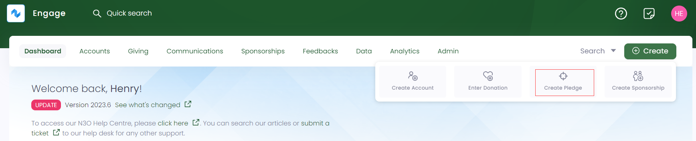
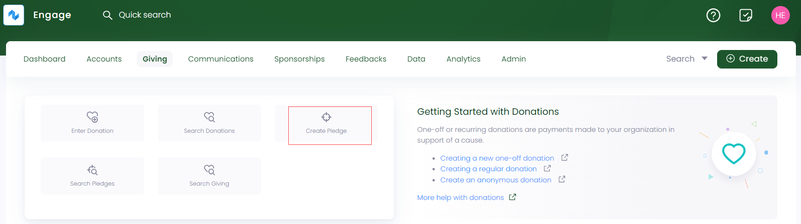

A pledge is a formal promise or commitment made by an individual or organization to contribute a specified amount of money in support of a cause or charity. In Engage, the first step to creating a pledge is landing on the **Create Pledge** screen. Either use method 1 or 2 and start the creation process. 

## Method 1: Create a Pledge via Create Button

:::tip
- To avoid any duplicate pledges and their problems, first <K2Link route="docs/engage/donations/allocations/pledges/search-pledge/" text="search for a pledge" isInternal/> within Engage.
- By default, a pledge will be processed as **anonymous**. You can select **Change Account** to associate a pledge with a specific account. 
:::

- On the <K2Link route="dashboard" text="Engage dashboard" isEngage />, click the **Create** button. A bar containing different icons will be shown.

- Click the **Create Pledge** button. This will take you to the **Create Pledge** screen.

## Method 2: Create a Pledge via Giving Dashboard

- On the <K2Link route="giving" text="Giving dashboard" isEngage />, navigate to **quick navigation**.

- Click **Create Pledge** and navigate to the **Create Pledge** screen.

## Steps to Create a Pledge

After navigating to the **Create Pledge** screen, perform the following steps.

1. In the **information** section, select the **Date**. By default, current date is displayed.

2. **Name** the pledge whatever you want and choose the **Source**, whether **internal** or **3rd Party**. In case of 3rd party, define the required **external references**. 

:::note
Internal sources are managed by your system administrator.
:::

3. Choose **Enable Allocations** as yes or no. If **yes**, then an **Allocations** section appears, where you can allocate funds, existing sponsorships, or feedbacks to the pledge. You can also add extra amount in **Allocate Later** text box and the total amount will be shown at the bottom right. 

:::tip
If you select **no** in the Enable Allocations section, they can be added after a pledge's creation. Click the **three dots(...)** while viewing a pledge and select **Add Allocations**. An Allocations section will appear under the information section of the pledge.

:::

4. Lastly, specify an **amount** to contribute to the pledge if no allocation is added, associate any **task** to the pledge by selecting yes or no, and click **Create**.

