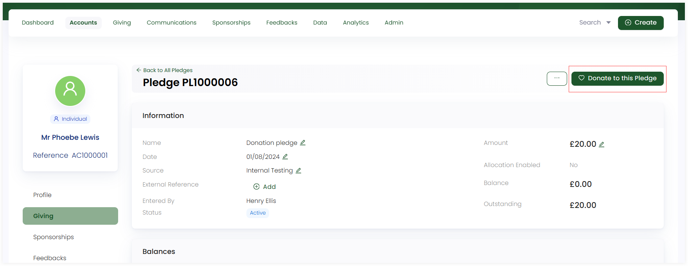

In Engage, a donor can donate towards a specific pledge anytime after its creation. This donation can be both single or regular giving. To learn more about donations, refer to the <K2Link route="docs/engage/donations/" text="Donations Documentation" isInternal/>.

To make a donation towards a pledge, follow the steps defined.

**1.** View an existing pledge from an account's giving profile by clicking the **pen icon** or <K2Link route="docs/engage/donations/allocations/pledges/search-pledge/" text="search for an existing pledge" isInternal/> and click the **Donate to this Pledge** option. 

**2.** The **Allocations section** will be prepopulated with a small clickable note, **Towards Pledge - Pledge Reference**, leading to the detailed actual pledge. You can add allocations like funds, sponsorships or feedbacks as required.

:::note
- If an allocation was added while creating the pledge, then it will appear in the Allocations section, while donating.
- You can also hover over the clickable note to view the minimal information of the pledge including the account that created the pledge, pledge reference and amount allocated to pledge etc.
:::

               

3. The total amount would be the amount donated and shown at the end of the Allocations section. Click **Save and Continue to Payment** and pay via the payment methods available in the **Payments** section. Select the **payment type**, enter the required details and click **Enter donation**.

:::note
- Pledges created with advance allocated payments will have that amount deducted from the pledge payment when making a donation and are considered with status complete when the all amount allocated has been donated.
- To read more on how to make payments, go to <K2Link route="docs/engage/donations/payments/payment-types-and-methods/" text="Payment Types and Methods Documentation" isInternal/>.
:::
