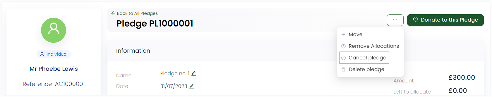
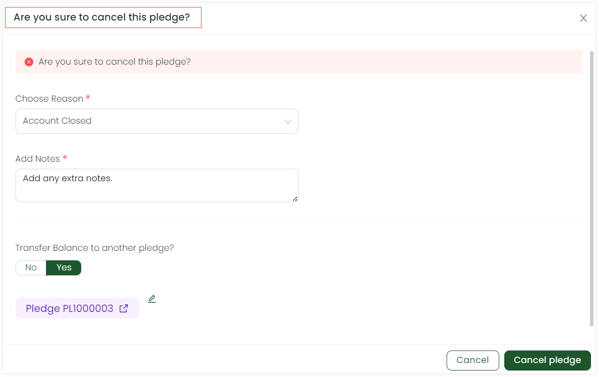

In Engage, you can cancel any existing pledge. Cancellation can occur due to many reasons e.g. an account that created a certain pledge got closed, the pledger had some financial issues or unanticipated events occurred like emergencies etc.  

To cancel a pledge, follow the steps.

**1.** View an existing pledge from an account's giving profile by clicking the **pen icon** or <K2Link route="docs/engage/donations/allocations/pledges/search-pledge/" text="search for an existing pledge" isInternal/> and click its reference.

**2.** On the top left-hand side, click the **three dots (...)** and select **Cancel Pledge**. 

:::note
Pledges with status **complete** cannot be cancelled.
:::

 

**3.** An **Are you sure to cancel this pledge** screen pops-up which will end the current pledge. Choose any cancellation reason from the drop-down, add any extra notes, choose whether to transfer the donation amount of this pledge to another pledge as yes or no and click **OK**.

:::note
If you choose yes, a search pledge screen pops up with a list of all existing pledges. Choose any pledge to transfer the amount to and that pledge reference will appear on the cancel pledge screen.
:::

