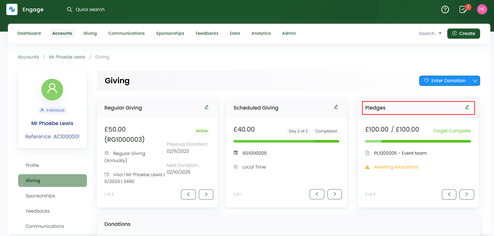
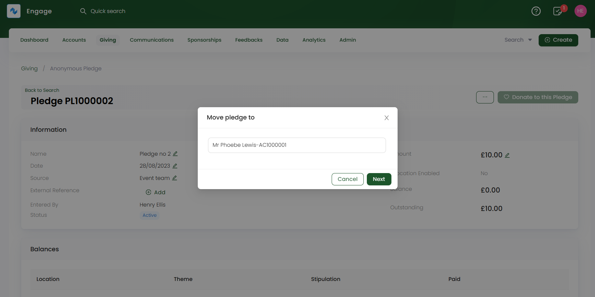
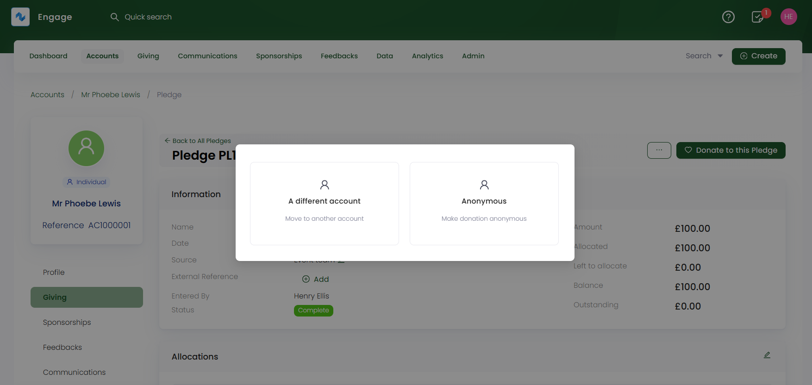
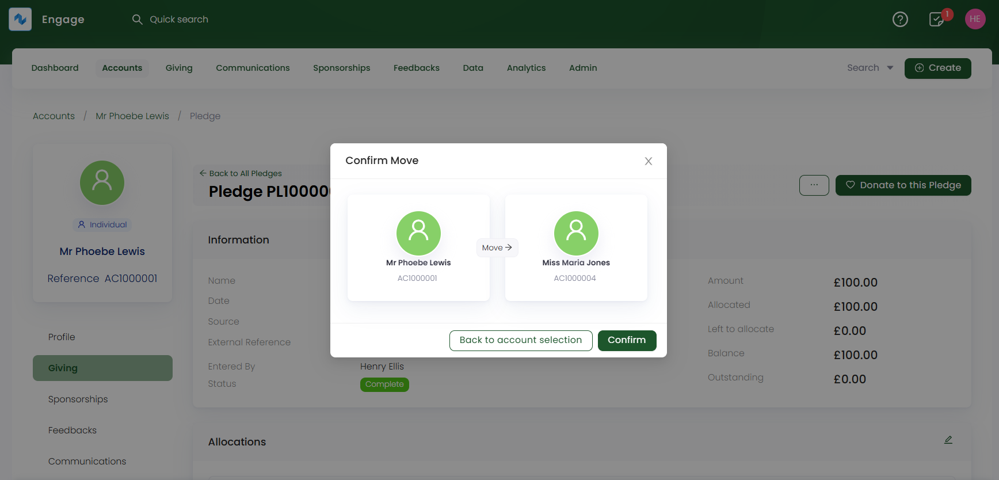

In Engage, a donor can move an existing anonymous or dedicated account pledge to another donor account. This can occur due to many reasons like donor preferences, donor leaving a pledge or a pledge not completing on time.

To move a single pledge, follow the steps defined.

**1.** Select a pledge from an account's profile: **Giving** section, by clicking the **pen icon** under **Pledges** or <K2Link route="docs/engage/donations/allocations/pledges/search-pledge/" text="search for an existing pledge" isInternal /> and land onto the pledge screen. *"The selected pledge can be anonymous or dedicated to a donor account"*.

**2.** Click the **three dots (...)** and select **-> Move**. A dialog appears asking to move the pledge.

- If you are moving an **anonymous pledge**, select the donor account and click **Next**.

- If you are moving a dedicated **donor account pledge**, choose whether to move the pledge to a **different account** and select the donor account, or make it **anonymous**, and click **Next**.

**3.** Lastly, another dialog appears asking to **confirm the move**. If you are proceeding correctly, click **Confirm** and the pledge moves from its old location to the new one.

