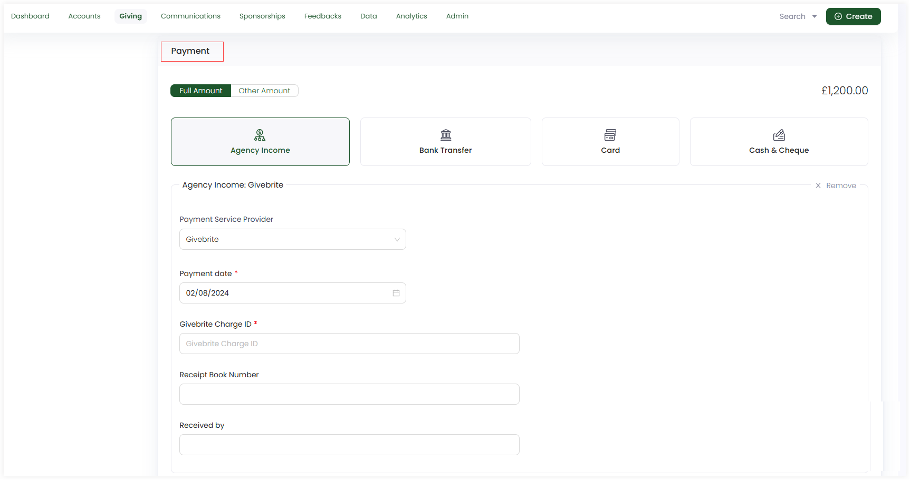
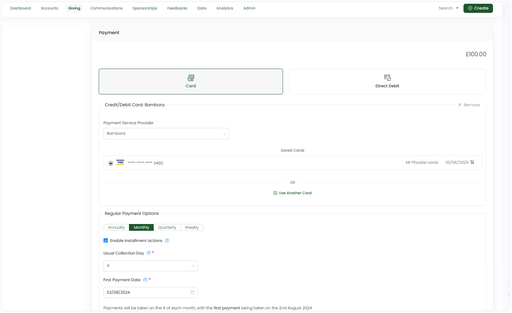

In Engage, payments are added while making a single donation or regular giving. As soon as an amount for a donation is allocated, there comes a separate **Payment** section to complete the donation.

:::tip
Single donations include all the payment types, but regular donations include **card** and **direct debit** only.
:::

## Single or Anonymous Donations

**1.** Select any payment type. Each payment type has its own required fields to fill in with **Payment date** being a similar field. Let us choose **Agency Income**.

**2.** Select the **Payment Service Provider**. This includes all the payment methods that the system administrator has added for you.

**3.** Input the required fields. For e.g. agency income **Givebrite** has **Givebrite Charge ID**, **Receipt Book Number** and **Received by** fields. 

**4.** Each payment can be made in **full amount** or **other amount**, if needed.

## Regular Giving

**1.** Select a payment type, **Card** or **Direct Debit**. Both have their own fields to be filled in with direct debit leading to a  **Gocardless debit external service**. 

**2.** Select the **Payment Service Provider**. This includes all the payment methods that the system administrator has added for you.

**3.** Input the required fields. For e.g. **Card** has **Cardholder Name**, **Card Expiry**, **Number** etc.

**4.** Each payment method has a **Regular Payment Options** section to be filled up explained in the table below. 

| Options | Description |
| ------- | ----------- |
| **Payment Given** | Paying the regular donation as **annually, monthly, quaterly or weekly**. |
| **Usual Collection Date** | Which day of the month should payments ordinarily be taken. |
| **First Payment Date** | The very first payment may be taken on a different day of the month to the usual collection day, if desired. |  
| **Enable installment actions** | To generate a correspondence such as a receipt each time a donation is collected. |

